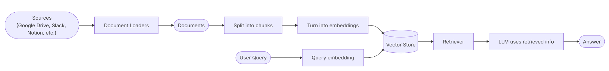
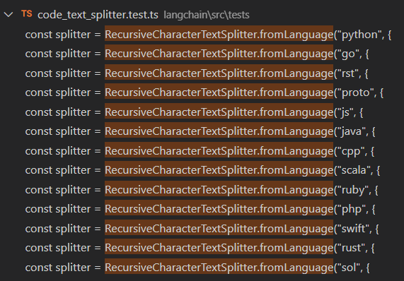

Retrieval-Augmentd Generation: 检索增强生成
好端端的，为什么会产生这么一个技术呢？
原因要追溯到 LLM 的缺陷

---
## LLM 的缺陷
这一切的前提是， 理解 LLM 到底是什么？ - 可以抽象成一个函数， 能识别自然语言，通过一些算法架构和训练资料，能够推断出用户想知道的答案是什么。

主要有两个： 
+ 功能性缺陷 - 知道用户想做什么，但是 LLM 无法做到 -> Function Calling / MCP
	+ 用户想知道北京今天的天气如何？ LLM的资料库没有今天的资料 -> 所以得去调接口，获取天气
+ 知识性缺陷 - LLM 不理解用户想干什么 -> prompt engineering / RAG
	+ 用户提问公司内部资料或市面上不存在的东西 -> LLM 根本不知道用户在讲什么，很有可能出现乱回答的情况(我们称之为：幻觉) -> 最根本的原因，不就是 LLM 不知道嘛， 让它知道即可

---
RAG 解决的呢，就是 LLM 的知识性缺陷，具体一点：
+ 上下文的限制
+ 内部资料、专业性
+ ...
所以，RAG 就很适合做 企业内部知识库、个人知识库、某专业领域的专业回答等

## 基本流程
一般的 RAG 流程类似于这样：


1. 加载资源 loader - 文档过多/大？
2. 文档拆分 split - 怎么拆分? 语义不对？
3. 嵌入 embedding - 嵌入模型
4. 存储 store - 向量数据库
5. 检索 retrieval - 怎么提升精确度？召回率？

当然上述流程，是个人理解

## 文档加载
langchain 支持市面常见的文档，所有的 loader 都继承至 BaseDocumentLoader ， 这个抽象类实现了 DocumentLoader 这个接口，提供 load 方法。 

+ load()： 一次加载所有文档
+ loadAndSplit(): 一次加载所有文档，并拆分成更小的模块

langchain 支持多模态的用户输入， 不仅仅有文档，还有web相关，
具体可看官网：
https://docs.langchain.com/oss/javascript/integrations/document_loaders

### 以 pdf 文档为例
其实在内部调的是 pdf-parse@v1 ，将 pdf 上的文字解析出来
```js
import { PDFLoader } from "@langchain/community/document_loaders/fs/pdf";
import { dirname, join } from "path";
import { fileURLToPath } from "url";

const __filename = fileURLToPath(import.meta.url);
const __dirname = dirname(__filename);

const filename = join(__dirname, "../test.pdf");

const readPDFDocument = async (filename) => {
  const loader = new PDFLoader(filename);
  const docs = await loader.load();
  console.log(docs);
};

readPDFDocument(filename);
```

返回结果：
```js
Document {
  pageContent: 'xxxx'
  metadata: {
    source: '文件地址',
    pdf: {
      version: '1.10.100',
      info: [Object],
      metadata: null,
      totalPages: 文档页数
    },
    loc: { pageNumber: 1 } // 当前页数
  },
  id: undefined
}
```

## 文档拆分
langchain 中默认使用 `Splitting recursively`  这个函数进行拆分
`pnpm install @langchain/textsplitters`

大致分为三种拆分策略：
+ 基于文本结构的 - 根据句子、段落、词语等进行拆分
+ 基于长度的
	+ 基于token的
	+ 基于文字的
+ 基于文档结构的 - 一般用于已有结构的文档，像 html、json、markdown 等

### Text structure-based
默认的文本拆分是基于： ["\n\n", "\n", " ", ""]，为了处理不同语言的结束符号。像中文的 '。' 就需要用 ASCII 码的方式加到拆分规则中.

```js
 const separators = [
    "\n\n",
    "\n",
    " ",
    ".",
    ",",
    "\uff0c", // ，
    "\u3001", // 、
    "\uff0e", // .
    "\u3002", // 。
    ",",
  ];
```

```js
import { RecursiveCharacterTextSplitter } from "@langchain/textsplitters";

const splitter = new RecursiveCharacterTextSplitter({ 
	separators,
	chunkSize: 100,  // pageContent 字符大小
	chunkOverlap: 0  // 是否重叠 - 为了防止拆分语义不全
})

// 这个 document 是 Document 对象
// [{pageContent: xxx}, {...}]
const texts = docs.map((doc) => doc.pageContent); // 有可能需要处理一下
const splitDocs = splitter.createDocuments(texts);
```

返回值：
```js
[
  Document {
    pageContent: 'xxx',
    metadata: { loc: [Object] },
    id: undefined
  },
  Document {
    pageContent: 'xxx',
    metadata: { loc: [Object] },
    id: undefined
  }
  ...
]
```

### Length based
以文档长度为基于拆分，最大的好处就是 **直接** 
#### Token
```js
import { TokenTextSplitter } from "@langchain/textsplitters";

const splitter = new TokenTextSplitter({ 
	encodingName: "cl100k_base", // 编码名称
	chunkSize: 100, 
	chunkOverlap: 0 
})

// doucment -> Document 对象实例
const texts = splitter.splitText(document)
```

#### characters
```js
import { CharacterTextSplitter } from "@langchain/textsplitters";
import { readFileSync } from "fs";

const stateOfTheUnion = readFileSync("test.txt", "utf8");

const splitter = new CharacterTextSplitter({
    separator: "\n\n",
    chunkSize: 1000,
    chunkOverlap: 200,
});
const texts = splitter.createDocuments([{ pageContent: stateOfTheUnion }]);
console.log(texts[0]);
```

### Document structure-based
支持解析各种有结构的文档，例如： 各种编程语言、markdown等

`RecursiveCharacterTextSplitter.getSeparatorsForLanguage("js") ` ： 可以查找特定语言的分隔符

#### markdown 格式
```js
const test = async () => {
  const textSplitter = new RecursiveCharacterTextSplitter({
    chunkSize: 100,
    chunkOverlap: 20,
  });
  const docs = await textSplitter.createDocuments([markdownText]);
  return docs;
};

test().then((docs) => {
  console.log(docs);
});
```

markdown 格式的数据，调用方式跟其他的文本类型保持一致了，不是 25-12-6 上官方的实例
估计还没改文档，源代码上 formLanguage 的方式现在统一支持编程语言。


#### 编程语言
以 python 为例：
```js
import { RecursiveCharacterTextSplitter } from "@langchain/textsplitters";

const code = `def hello_world():
  print("Hello, World!")
# Call the function
hello_world()`;

const test = async () => {
  const splitter = RecursiveCharacterTextSplitter.fromLanguage("python", {
    chunkSize: 16,
    chunkOverlap: 0,
  });

  const docs = await splitter.splitText(code);
  return docs;
};

test().then((docs) => {
  console.log(docs);
});
```

返回值：
```js
[
  'def',
  'hello_world():',
  'print("Hello,',
  'World!")',
  '# Call the',
  'function',
  'hello_world()'
]
```

---
总结：
+ 拆分的是纯文本 - 实例调用 splitText() 像 TokenTextSplitter 、 拆分编程语言
+ 其他的 - 实例调用 createDocuments([{pageConent: xxx, metadata: xxx}])  
	+ 传递的是 Document 对象数组
+ 虽然看起来很简单的样子，但 langchain 一直发展，并且 1.0 版本刚刚发布，有很多核心东西被改动了。文档和导包都有点不准确，还是得手动试一下

## 嵌入
### 向量化
说人话就是，将拆分的数据进行**向量化**
欸，这个向量化怎么理解呢？
- 可以理解为从**不同角度**描述某个词语
- 角度：可多可少， 越多描述的越准确 - 实际最少维度 ： 50左右， 实例最多维度如下

| 模型/系统                  | 常见最大维度                                    |
| ---------------------- | ----------------------------------------- |
| Word2Vec (Google News) | 300 维                                     |
| GloVe (Common Crawl)   | 300 维                                     |
| FastText               | 通常 100–300 维                              |
| BERT / Transformer 类模型 | 768 维（BERT-base）、1024 维（BERT-large）       |
| 最新大模型（如 Llama, GPT）    | 词向量（token embedding）可达 **4096、8192 甚至更高** |

还是不理解？
举个例子：
苹果（这是一个抽象的概念） -> 为了描述清楚，我可以从以下方面进行描述
 + 甜度: 0.7
 + 水分: 0.5
 + 新鲜度: 0.6
 + 颜色: 0.2
 + 名称: 0.4
 + 等
人为规定一个标准，如果当前这个苹果，越接近某个维度的描述，那么值就越高
最后就形成一个描述苹果的一维数组.
apples = [0.7, 0.5, 0.6, 0.2, 0.4, ...] 当然实际用算法计算的，肯定比这个要精确.

---
用更为精准的描述：
> **向量化 = 从多个预定义的“语义/特征维度”去刻画一个抽象对象，每个维度上的数值表示该对象在该特征上的“强度”或“相关性”，最终形成一个数值向量**

通过计算两个向量的 **余弦相似度** 或 **欧式距离**，就能判断在向量空间上，某两个东西有多像 --> 死去的线性代数知识正在攻击宿主，算正相关和负相关。之前还真是，学了就是学了，也不知道有啥用。

但是， 这个社会是残酷的，这里也是。 **维度不是人定的，而是隐式的、数据驱动的** - 这块应该跟 LLM 的底层架构相关（transformer）

---
数学真的很神奇！
这么高的维度，这么降下来呢？ --> t-SNE / UMAP 将高维降成 2d 可视化

### Embedding models
> 嵌入模型

常见的计算相似度算法：
+ Cosine similarity - 余弦相似度
+ Eucildean distance - 欧式距离
+ Dot product - 点积

在 langchain 中，集成了各大厂商提供的嵌入模型
https://docs.langchain.com/oss/javascript/integrations/text_embedding#all-integrations

主要有两个接口，来调用嵌入模型处理数据
+ `embedDocument(document: string[]) -> number[][]`
+ `embedQuery(text: string) -> number[]`

```js
import { AlibabaTongyiEmbeddings } from "@langchain/community/embeddings/alibaba_tongyi";
import { RecursiveCharacterTextSplitter } from "@langchain/textsplitters";
import { isFileExits } from "./utils.js";
import { dirname, join } from "path";
import { fileURLToPath } from "url";

import fs from "fs";
import dotenv from "dotenv";

dotenv.config();

const __pathname = fileURLToPath(import.meta.url);
const __dirname = dirname(__pathname);
const filename = join(__dirname, "../test.txt");

const embeddings = new AlibabaTongyiEmbeddings({
  apiKey: process.env.ALIBABA_TONGYI_API_KEY,
});

const handleText = async (filename) => {
  await isFileExits(filename);
  const text = await fs.promises.readFile(filename, "utf-8");
  const splitter = new RecursiveCharacterTextSplitter({
    chunkSize: 20,
    chunkOverlap: 0,
  });

  const docs = await splitter.splitText(text);
  return docs;
};

const embed = async (docs) => {
  const documents = docs
    .map((d) => {
      if (/[\u4e00-\u9fff]/.test(d)) return d; 
    })
    .filter((d) => Boolean(d));
  const res = await embeddings.embedDocuments(documents);
  return res;
};

```

返回值：
是一个二维数组，每一项都是对 docs 的向量化数组
```js
[
  [
       0.02461062371474583,     0.03400574077530988,    0.01188520499694119,
    -0.0007666950202878997,     0.02334266482689735,   -0.01930963896675278,
     -0.019004106704620615,   0.0059387833451939424,   -0.02820062779479876,
      0.011686609026555283,    0.022258025296328164,  -0.004735750063048546,
      0.035930594026742514, -0.00039504366705369676,   0.024977262429304425,
      0.014902336085496312,   0.0015190682157883541,    -0.0251147519472639,
      -0.03538063595490462,  -0.0032157270589410285,  -0.016788997804162424,
     -0.029438033456434025,    -0.01836248895414307,    0.03699995694420509,
     -0.019615171228884943,   ...
  ]
  ...
]
```


## 存储
> 就像关系型 / 非关系型数据库，有各种各样的数据库（mysql、mongo、pg、还有国产数据库）。存向量这么特别的东西，当然也会有**向量数据库**

向量数据库，提供的核心功能：
+ 增删
+ Retrieval - 内置了相似度比对算法

langchain 中，市面上的向量数据库基本上都支持
https://docs.langchain.com/oss/javascript/integrations/vectorstores#all-vector-stores

langchain 中，提供了统一的接口来操作向量数据库
+ addDocuments
+ delete
+ similaritySearch

### 以 Chorma 为例
在本地启动 chorma 数据库
```js
docker pull chormadb/chorma
docker run -d -p 8000:8000 chormadb/chorma
```

**初始化** ： 接收 embedding model

```js
import { OpenAIEmbeddings } from "@langchain/openai";
import { MemoryVectorStore } from "@langchain/classic/vectorstores/memory";

const embeddings = new OpenAIEmbeddings({
  model: "text-embedding-3-small",
});
const vectorStore = new MemoryVectorStore(embeddings);
```

**添加数据**
```js
import { Document } from "@langchain/core/documents";
const document = new Document({
  pageContent: "Hello world",
});
await vectorStore.addDocuments([document]);
```

**删除数据**
```js
await vectorStore.delete({
  filter: {
    pageContent: "Hello world",
  },
});
```

**相似度比对**
```js
const results = await vectorStore.similaritySearch("Hello world", 10);
```

## 检索
