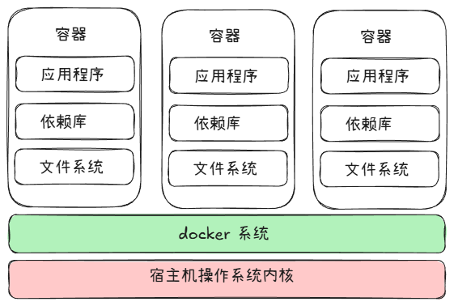
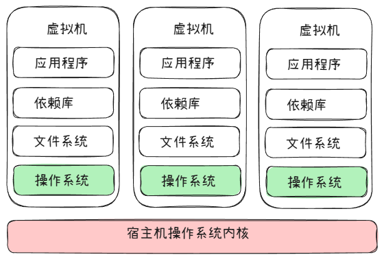

> 这位更是不用说，神中神

docker 简单来说，就是将某套应用程序依赖的环境，文件封装独立的运行环境。每个**运行环境**就是一个容器， 镜像可以类比于应用程序的安装包。镜像是运行在容器上的。

镜像可以上传到镜像仓库，给其他人使用 - 官方镜像仓库： docker hub

docker 与 虚拟机的最大区别：
+ docker 是共用一套系统内核
+ 虚拟机 都包含一个操作系统的完整内核

docker 运行模式：


虚拟机 运行模式：



## 镜像与容器
镜像类似于"类"、"模板" （由应用程序打包而成的，会将应用程序所依赖的库都记录下来，这样不管在哪里使用该应用程序，用的依赖都是一样的）

容器简单的说，就是镜像的运行的实例

## 下载镜像
`docker pull docker.io/library/nginx:latest`  
+ docker.io - registry 仓库地址 
	+ docker.io 是官方维护的地址
+ library - 命名空间： 上传镜像的作者
	+ library 是官方
+ nginx - 镜像名
+ latest - 版本号： 默认最新

`docker pull --platform=xxx nginx:latest` 选择特定CPU架构的镜像

--- 
国内需要换一下镜像地址
```js
"registry-mirrors": [
    "https://docker.1ms.run",
    "https://docker.xuanyuan.me",
    "https://docker-0.unsee.tech",
    "https://docker-cf.registry.cyou",
    "https://docker.1panel.live"
  ]
```

## 查看所有镜像
`docker images` 

## 删除镜像
`docker rmi nginx / id `

## 运行镜像
`docker run nginx / id`

**后台运行： -d**
`docker run -d nginx`

**端口映射： -p**
默认情况下， 宿主机与容器是隔离的， 不能直接访问 容器的网络

`docker run -p 80:80 nginx` 
80:80 先外后内， 将宿主机的 80 端口映射为容器的 80 端口， 这样， 用户访问宿主机的 80 端看，其实访问的是容器的 80 端口

**重命名容器名字：** --name
`docker run -d --name my_nginx nginx`
注意：这个名字需要在宿主机上是唯一的

**与容器进行交互 : -it / 容器停止时，删除容器: --rm** 
`docker run -it --rm alpine`
可用来临时调试容器

**配置容器停止时的策略**
`docker run -d --restart always nginx`  
+ always ：只要容器停止了，就会重启
+ unless-stopped ： 类似于 always ，但如果是手动停止的，不会重启

## 挂载卷
### 绑定挂载
`docker run -v 宿主目录:容器目录`
其实就是将容器的文件系统与宿主机的文件系统进行双向绑定， 如果将容器删除，也不会造成数据丢失。相当于本地持久化存储。

==注意： 使用绑定挂载的时候， 宿主机的目录会（暂时）覆盖掉容器内的目录==

### 命名卷挂载
让 docker 创建一个存储空间， 挂载时直接使用存储空间的名字即可

创建命名卷(存储空间)
`docker volume create 卷的名字`
`docker run -v 卷的名字:容器内目录`

命名卷在宿主机上的真实地址：
`docker volume inspect 卷的名字`

==注意： 使用命名卷，docker 会自动将绑定的容器目录的内容 copy 一份==

查看所有被创建的卷
`docker volumn llist`

删除创建的卷
`docker volumn rm / remove`

删除没有被任何容器所使用的卷
`docker volumn prune -a`

## 传递环境变量
在某些场景下，可能设置 环境变量 会更加方便开发。比如，用 docker 启动数据库服务， 一般都需要设置账号和密码啥的。这两个可以通过运行时，直接传递进去。

`docker run -d -p xxx:xxx -e 环境变量`
不知道的可以去 镜像仓库 或 github 上找

## 创建容器
与 run 命名类似，但只创建，不启动
`docker create -d -p xxx:xxx nginx`
`docker start id`

## 查看容器
`docker ps`
+ -a : 查看所有容器（正在运行和已停止的）

## 停止容器
`docker stop id`

## 启动容器
`docker start id / 自定义名字`

注意： 已经配置过的参数，再次启动时不需要重新配置，docker 已经记录了

如果想查看配置时参数：
`docker inspect id / 自定义名字`

## 删除容器
`docker rm id / 自定义名字` 

删除正在运行的容器 - 强制删除
`docker rm -f id / 自定义名字`

## 查看容器日志
`docker logs xxx`
`docker logs xxx -f` ： 滚动查看日志

## 构建镜像
一般工程化项目中，都会有一个配置文件 **Dockerfile**
会在`ci/cd` 时根据这个文件，创建镜像 - 随后在服务器用 docker 来运行这个镜像

Dockerfile 文件中，会包含项目的打包命令之类的

`docker build -t 镜像名字 版本号` - 构建镜像
`docker login`
`docker push 用户名/xxx` - 推送镜像

## 进入容器内部调式
`docker exec -it <容器ID> sh`

## docker compose
前因： 现代化的应用程序，一般都会有 前端 + 后端 + 数据库。 如果用将三个部分全部放到一个大容器中，只要有一个服务挂了，其他的服务也不能访问。

因此，这种方式，不契合现代程序。更加完美的方案是，将每一个部分都做成一个容器，然后独立运行每个容器。

docker compose - 容器化编排技术 => 管理容器调度运行的
读取 `docker-compose.yaml` 文件 - 该文件列出了容器之间是如何创建、如何协同工作的
注意： docker 会为每一个 docker-compose 文件中都创建一个子网， compose 文件中容器会自动归属于一个子网

**启动compose文件**
`docker compose up -d`

**停止并删除容器**
`docker componse down`

**只停止**
`docker componse stop`

**开启**
`docker componse start`

**查看日志**
`docker compose logs -f server` 查看 server 服务的日志

---
企业级的容器编排技术，需要用到 k8s -> 这个功能更全，更牛逼~

