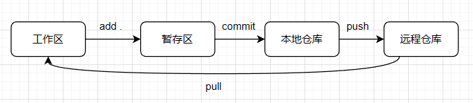

# git 
> git 也是团队协作中，必不可少的一部分，太牛逼了，我只能说

## 基本概念
git 中的三个概念
+ 本地仓库
+ 暂存区
+ 工作区
+ 远程仓库
  


**工作区**： 其实可以理解为，在编译器中 未提交 的代码
**本地仓库**： commit 之后的代码存在的地方
**暂存区**：add . 之后代码存在的地方
**远程仓库**：云端开源社区，比如，gitee / github...

## 快速上手
```bash
git clone xxx # 克隆项目
git pull # 获取最新的代码
# 在本地打开项目，修改代码，git 状态改变
git add . # 将所有状态改变的代码加入暂存区
git commit -m "说明信息" # 加入本地仓库
git push  # 将本地仓库更新到远程仓库 
```

但这里需要注意的是，首次 push 会有报错
```bash
# 将远程仓库地址关联到本地，并命名为 origin
git remote add origin <remote-repo-url>
```

使用 -u 或 --set-upstream 参数，建立本地分支和远程分支的追踪关系
```bash
git push -u origin main # 本地仓库提交到远程的主分支名称 main
```
---
恭喜你，git 的 helloworld 你会了

### 关联仓库
如果本地已有仓库，想关联到远程仓库（最好是空仓库，没有.gitignore等文件，不然可能会有合并冲突。有也没有关系，无非push是解决一下合并冲突即可）

一般使搭建工程化项目，使用脚手架都会自带 .gitignore 等文件（本地仓库就搭建完成了）
```
进入项目目录
git init -> 生成 .git文件

关联仓库
git remote add origin <远程仓库地址>
```

## 切换分支
使用场景：什么时候会切换分支呢？
- 不想破坏主分支代码
- 搞点小实验
- 等

**创建并切换到新分支**
`git switch -c <branch-name>` 也可用 checkout 相关指令

**删除分支**
`git switch -d <branch-name>` -D 强制删除

**删除远程分支**
`git push <remote> --delete <remote-branch-name>`

**本地分支与远程分支的对应关系**
`git branch -vv` 

**查看本地分支**
`git branch -v`

## 查看状态
`git status` 被git追踪的状态[修改、删除、添加、加入暂存区等] 
`git log` 查看git的提交日志
`git log --pretty=oneline --graph --abbrev-commit <branch-name>` 更友好的方式查看日志

## 暂存代码
使用场景：当你A需求写到一半，来了一个紧急的需求（另一个分支），需要你马上去支持。

```bash
# 保存当前工作区的代码
git stash save "暂存说明"

# 查看暂存的代码
git stash list

# 取出暂存代码【存是以栈的方式】
git stash pop # 取第一个
git stash pop stash{n} # 指定第几个

# 删除
git stash drop stash{n}
```

注意：stash只能保存被git追踪的代码，如果你新增了一个文件，这个文件不会被git追踪
所以，
```bash
git add .
git stash save "xxx"
```

## 合并冲突
一般，合并冲突会发生在，更改了同一个文件 / 很久没有 pull 代码 / merge / push等
处理起来，其实很简单，在编译器中都有图形化展示有冲突的代码，选择即可（一般会自动生成一个 合并的commit）
类似于 `Merge branch 'qfusion-master' into qfusion-local-dev`

**中止合并冲突**
`git merge --abort`

为了避免合并冲突：
**本地与远程分支名是一致的情况**
```bash
# 在所在分支（没有在本地创建分支），提交之前
git stash save "xxx" # 暂存修改
git pull 
# 有冲突解决冲突
git stash pop
git add .
git commit -m "xxx"
git push
```

**在本地创建了新分支，但不提交到远程**
假设：本地主分支为 A，远程分支为 OA，A 与 OA 是对应的，通过 -u / --set-upstream 确定了push关系
此时在 A 分支的基础上，创建了 A’（在 A' 上进行开发，A‘分支不提交到远程）
```bash
# 在 A‘ 分支上
git stash save "xxx"
git switch A # 切换到 A 分支
git pull
git switch A'
git merge A
git stash pop
git add .
git commit -m "xxx"
git switch A
git merge A'
git push
```
但注意，这样做还是会有风险
有可能在 merge A' 之前，有同事先 push 到远程了，那么也会有合并冲突

--- 
一般常用的就是这些操作了，还有一些 fetch / rebase ...

## git 提交的规范
- `refactor` 代码重构（既不修复 bug，也不新增功能，仅改善结构）
- `chore` 杂项维护（如更新依赖、调整构建配置等）
- `build` 构建系统或外部依赖的变更（如 Webpack 配置优化）
- `feat` 新增功能
- `fix` 修复bug
 

## 远程操作
**删除远程分支**: `git push origin -d <branch-name>`


