# 基础架构

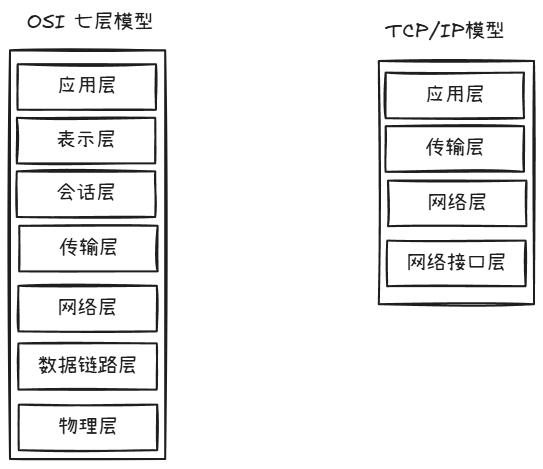

# 网络接口层
>  实际上功能类似于 ： 物理层 + 数据链路层

## 物理层
>  数据格式： bit 流（比特流）

*信道*
- 信噪比 = 信号平均功率 / 噪声平均功率 （分贝 dB）
- 香农定理 - 信道的噪声越大，信道的极限传输速率越高

*传输设备*
- 引导型
	- 双绞线
	- 同轴电缆
	- 光纤
- 非引导型
	- 无线电波
	- 微波信号

## 数据链路层
>   数据格式： 帧

作用： 
1. 封装成帧
2. 差错检测 - 采用*循环冗余校验（CRC）*
3. 透明传输 - 所有的数据都能传输，没有特殊字符不能传递

## 帧的格式
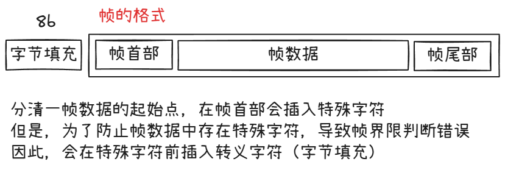

这里需要注意的是，以太网 802.3 规定了*最大传输单元（MTU = 1500 B）* 
所以帧的数据不能超过 MTU

*MAC 地址*
- 长度： 48 位 - 通常用 6 组 16 进制来描述
- 唯一性： 出产时，固化在网卡的 ROM 上
- 作用： 在局域网唯一标识某台主机

## MAC 帧格式
长度： `662N4`
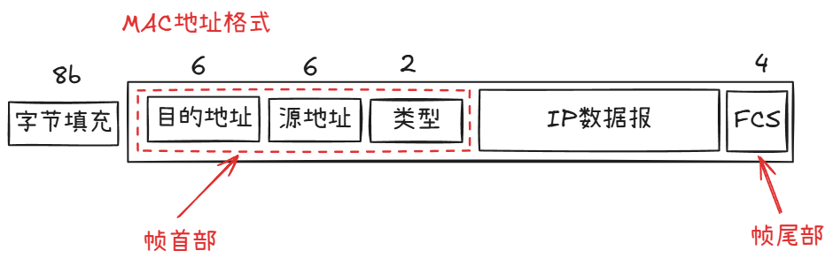

# 网络层
>  数据格式：IP 数据报

作用： 
- 异构网络互联 - 以太网（802.3）可以与 Wifi（802.11）不是一个协议 - 路由器
- 路由与转发 - 路由器
- 拥塞控制 - 也是通过路由器控制

## IP 协议
>  网络层最最最重要的东西之一
- 长度： 32 b
- 写法： CIDR - 点分十进制 - <网络前缀>，<主机号>
	- 例如： `198.1.1.1/24` - 说明前 20 位为网络号，后 12 位为主机号
- 子网掩码： 用于快速判断两个 IP 地址是否处于同一网络中
	- 若是 CIDR 写法 - 前 20 位为 1，后 12 为 0  - `255.255.255.0`
	- 判断两个 IP 是否属于同一网络
		- 先算出`子网掩码 & IP 地址`，若相同则为同一网络
- *与 IP 相关的协议*
	- `ARP`：地址解析协议 - 用于在局域网找到目标 IP 的 MAC 地址
	- `ICMP`：网际控制报文协议 -  为了提高有效转发 IP 数据报与交付成功的机会
	- `IGMP`：国际组管理协议
	- `DHCP` : 用于动态分配地址（应用层协议）

## IP 数据报格式
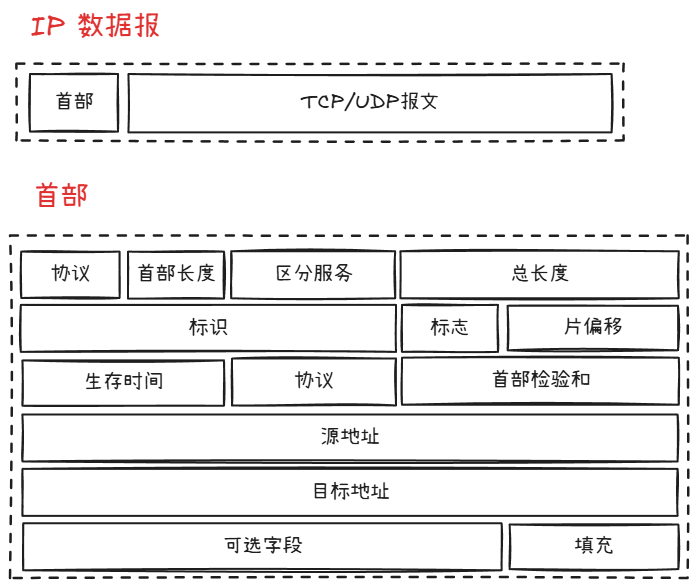

### 各字段解释
*协议*： 4 bit  --- ipv 4 / ipv 6
*首部长度* ： 4 bit  --- 首部区间[20, 60] --- 20： 固定长度 --- 60： 固定长度 + 可选字段
*区分服务* ： 8 bit --- 基本没用过
*总长度* ： 16 bit --- 首部 + 数据报长度（理论上 ip 数据报最长可达到：65535 B 但因为，MTU 限制 1500 B 所以超过 1500 B 就需要分片传输）
*标识* ： 16 bit --- 每产生一个数据报，计数器就加 1。当数据报由于长度超过 MTU 而必须分片时，这个标识字段的值就会被复制到所有的数据报片的标识字段中。相同的标识字段的值使分片的各数据报片最后能正确的组装成原来的数据报。
*标志* ： 3 bit --- 最低位 MF = 1 -> 还有分片； MF = 0 -> 这是最后一个分片
		   --- 中间位 DF = 1 -> 不能分片；DF = 0 -> 运行分片
*片偏移* ： 13 bit --- 某片在原分组中的相对位置 （起始位置 / 8） --- 每段分片都需要带上首部
*生存时间 TTL* ： 8 bit --- 表明了数据报在网络中的寿命 --- 每经过一个路由器，值会减一，为 0 时丢弃该数据报
*协议* ： 8 bit --- 数据报携带的数据是那种协议（TCP/UDP/ICMP...）
*首部检验和* ： 16 bit --- 只检验首部
*源地址* ： 32 bit
*目的地址* ： 32 bit

### IP 转发
步骤 1： 
	判断目标主机 IP 是否在同一网络中 ---> `目标IP & 子网掩码 != 源IP & 子网掩码 `
								 说明不在同一网络，需要路由器转发
步骤 2： 
	转发到网关路由器，到网络层 ---> 判断转发表 `前缀IP & 子网掩码 == 源IP & 子网掩码` ---> 转发到下一跳地址  

## NAT
>  网络地址转换

### NAT 分类
#### 静态 NAT
一对一的关系，一个内网的 IP 只能映射一个外网的 IP，地址映射关系保持不变（上图描述的就是这种关系静态 NAT）

常见应用：
+ web 服务器
+ 邮件服务器
+ 需要对外访问的服务
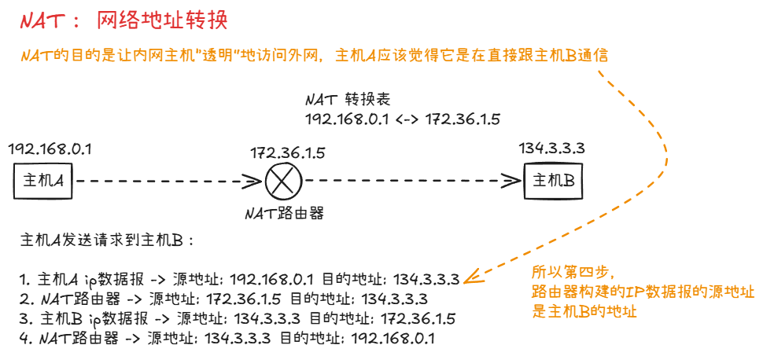

当然，这里需要注意一下，
- 按现实情况，路由器存放的是 NAPT 表（加了端口的转换）
- 外网不能直接访问内网主机，对于主机 B 而言，主机 A 的内网地址不是透明的，不能直接 -> 源地址 : 134.3.3.3 目的地址：192.168.0.1  路由器是不会理睬这个 IP 数据报的，因为目的 IP 不是自己的 IP

#### 动态 NAT
动态 NAT 使用 IP 地址池，可将多个私有 IP 地址映射到一个或多个公有 IP 

工作原理
-  当内网主机发起访问时，NAT 设备从 **地址池** 中选择一个公网 IP 进行映射。
-  连接结束后，该公网 IP 释放，可供其他主机使用。

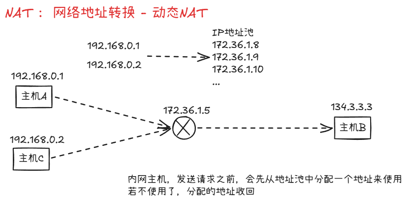

#### PAT
将 **多个私有 IP 地址通过不同端口映射到同一个公有 IP**
原理：
- 内网主机访问外网时，NAT 设备将 **IP 地址+端口号** 转换为 **公有 IP 地址+不同端口号**。
-  返回数据时，通过记录的端口号映射回正确的内网主机。

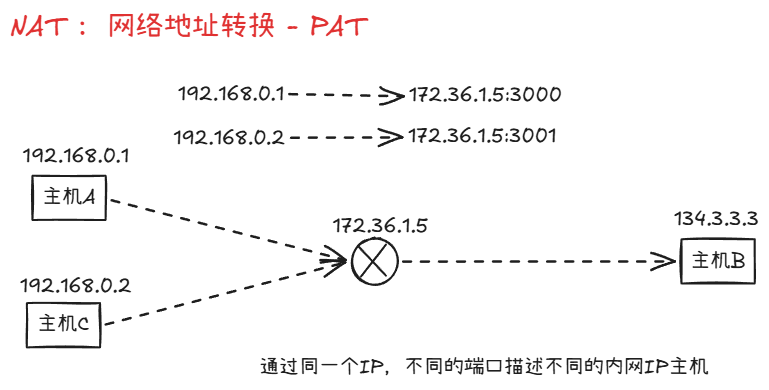

## ARP

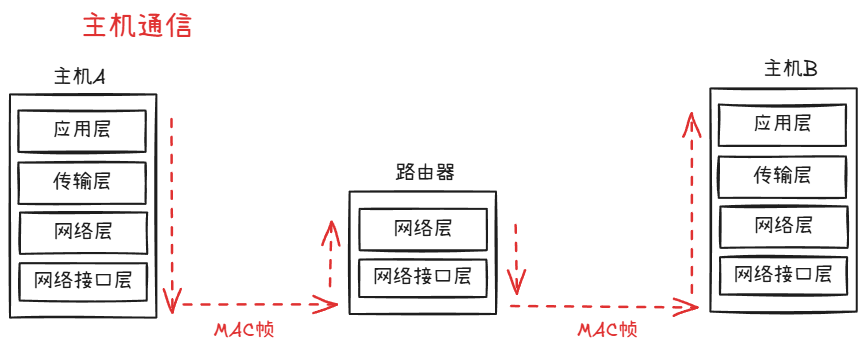

*为什么需要 ARP 协议呢？*
在主机通信中，网络层只能知道对方 IP，同理，网络接口层只能得知对方的 MAC
这里就有一个问题，在同一局域网下，主机 A 要给主机 B 发送消息（A 只知道 B 的 IP ，而不知道对方的 MAC 地址，不知道发给谁？）

ARP 在局域网内，可以通过 IP 地址得到对应的 MAC 地址

*原理*

ARP 请求 -> 局域网内**广播** -> 询问目标 IP 的 MAC 地址
		主机接收到请求，查看目标 IP 是否是自己
			- 若是 - ARP 响应 -> 目标主机将自己的 MAC 地址发送给源主机 (单播帧)
			- 若不是 - 丢弃

当然每台主机上，都会维护一个 ARP 高速缓存表（ARP cache），发送请求前，先查表，若没有则走 ARP 请求分组，ARP 响应分组回来后，将获取的 MAC 地址加入到缓存表中

每一个映射地址都会设置生存时间，若超过生存时间，则在表中删除

## ICMP
- ICMP 差错报告报文
	- 3 -- 终点不可达
	- 11 -- 时间超时（TTL 为 0）
	- 12 -- 参数问题
	- 5 -- 改变路由
- ICMP 询问报文
	- 8/0 -- 回送请求或回送回答
	- 13/14 -- 时间戳请求或时间戳回答

不应该发动 ICMP 差错报文的几种情况：
1. 对于 ICMP 差错报文，不再发送 ICMP 差错报文
2. 对于分片数据报
3. 对于多播地址数据报（224.0.0.0~239.255.255.255）
4. 对于特殊地址（127.0.0.1 / 0.0.0.0）

---
ICMP 的实际例子
- `ping` 命令 (回送请求报文) --- `ping ip/domain` 不要加协议（协议属于应用层，ping 属于网络层）

## 路由协议
### 静态路由 VS 动态路由
|类型|定义|工作原理|
|---|---|---|
|**静态路由**|管理员**手动配置**的路由条目，路径固定不变|路由器直接查表转发，不与其他设备交换路由信息|
|**动态路由**|路由器通过**路由协议自动学习**并维护路由表|路由器之间定期/触发式交换网络拓扑信息，自动计算最优路径|

### 动态路由协议

*RIP* 
适用于： < 15 跳的小型网络

原理：
1. 每 30 秒向邻居**广播**整个路由表
2. 收到路由后，跳数+1，选最小跳数路径
3. 180 秒未更新则标记不可达

*OSPF*
适用于： 中大型企业网/园区网

原理：
1. 建立邻居 → 同步链路状态数据库（LSDB）
2. 每台路由器用 Dijkstra 算法计算最短路径树
3. 仅当拓扑变化时触发更新（非定期泛洪）

*BGP*
适用于： 云服务商互联

原理：
1. 基于 TCP（端口 179）建立可靠邻居关系
2. 交换 NLRI（网络层可达信息）+ 路径属性
3. 通过策略引擎（Policy）决策最优路径

# 传输层
>  数据格式： 报文段

传输层的一个重要概念 *端口 16 bit(最大 65535)*  ---> *复用* 与 *分用*
应用层的每个进程，都会有一个端口来接收和传输数据

服务端： 1 - 1023
客户端： 49152 - 65535

*复用* ： 共同使用一个协议
*分用* ： 网络层接收到 IP 数据报时，提取数据部分，根据首部的目的端口号，分发到不同端口

### TCP
>  传输控制协议 

特点：
+ 面向连接 
	+ 通信前必须先建立 TCP 连接
	+ 传输数据
	+ 释放 TCP连接
+ TCP 连接是一对一通信（TCP 连接只能有两个*端口（不是网络层的概念，而是套接字 socket （IP 地址： 端口） ）* ）
+ 可靠服务：无差错、不丢失、不重复、有序
+ 全双工通信（可互发信息，有缓存）
+ 面向字节流

TCP 发送报文段时，会根据对方给出的窗口值和当前网络拥塞程度，来决定一个报文段应包含多少字节 --> 若应用程序传送到 TCP 数据块太大 --> TCP 会拆分成更小的数据库；若一次只有一个字节，那么 TCP 会等待积累足够多的字节才传送

而 UDP 发送的报文长度时应用程序决定的

#### 可靠传输
理论上：
+ 信道传输中不应该发生差错 -> 发生差错时让发送方重传发现错误的数据
+ 不管发送方以多么块的速率发送信息，接收方都来得及处理数据 -> 当一方来不及处理数据，另一方降低数据发送速率

*停止等待协议*
发送方发送一次信息给到接受方，接收方需要发送*确认收到* 的回信给到发送方
发送方接收到回信后，才会发下一次

*超时重传*
发送方在发送消息时，会在本地启动*超时计时器*，若接收方未在时间范围内将*确认分组* 的回信，发送给发送方
那么发送方会重新发送一遍上次分组数据
  
这里需要注意：
+ 发送方，需要备份分组数据
+ 分组/确认分组需要编号

*确认丢失*
即确认分组回信丢失，发送方会做两个动作
+ 丢弃重复分组
+ 接收方向发送方发送确认分组

*确认迟到*
确认分组回信，发送了，但是迟到了（超过了发送方的超时时间）
等发送方接收到信息时，那么发送方会丢弃迟来的信息

*累积确认*
接收方只需对按序到达的最后一个分组发送确认分组信息

#### TCP 首部格式
固定 20 B
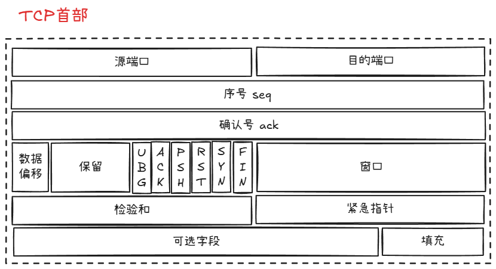

*序号 seq* ： 用于记录第一个字符在字节流中的位置
*确认号 ack* ： 期望收到对方下一个报文段的第一个数据字节的序号（ACK = 1，才启用）
*数据偏移* ： 4 bit 首部的长度
*保留* ： 6 bit 保留字段
*UBG* ：紧急 UBG = 1，紧急指针启用，事态紧急，不需排队
*ACK* ： 确认号 ACK = 1，确认号有效（连接建立后所有传递的报文段都必须 ACK = 1）
*PSH* ： 推送常用于交互式通信 PSH = 1，不需要等到整个缓存满了之后才向上交付
*RST* ： 复位 RST = 1，说明发送方出现严重错误，断开连接
*SYN* ： 同步 SYN = 1，握手 ①② -> SYN = 1 握手① -> ACK = 0，其他都为 0
*FIN* ： 终止 FIN = 1，挥手①③ -> FIN = 1 其他为 0 
*窗口* ： 实现流量控制的关键

#### 拥塞控制
>  拥塞: 在网络传输中，某段时间内，若对网络中某一资源的需求超过了资源所能提供的可用部分，网络的性能就要变坏。

TCP 中提供四种算法，来解决：
+ 慢开始
+ 拥塞避免
+ 快重传
+ 快恢复

### UDP
>  用户数据报协议

特点： 
+ 无连接的
+ 不可靠的
+ 无序的
+ 可进行一对一、一对多、多对多、多对一的通信

#### UDP 首部格式
UDP 首部长度： 8 B
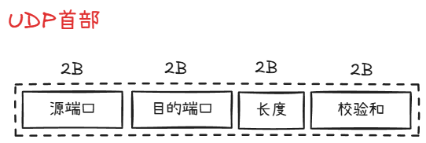

*源端口* ： 需要对方回信时填写端口号，一般为 0
*目的端口* ： 16 bit
*长度* ： 首部 + 数据的长度
*校验和* ： UDP 在校验时，会加上 12 B 的伪首部进行校验
+ IP 数据报只校验首部
+ UDP 会校验首部和数据部分

# 应用层

## DNS
> 域名解析系统

DNS 是一个*分布式系统*，即使单个计算机出了故障，也不会妨碍其他系统
把待解析的域名放到 DNS 请求报文中，以 *UDP* 的形式发送到 DNS 服务器

## HTTP/HTTPS
### HTTP
*HTTP/1.1* ： 持续连接 **keep-alive** （区别于 http 1.0 非持续连接 -> 每次请求文档，都需要建立 TCP 连接）；http 1.1 TCP 连接不断；
有两种工作方式：
+ 非流水线 -> 类似于*请求等待协议*，需要等待上一次响应返回后，才能发送下一次请求
+ 流水线 -> 客户端可连续发送请求，无须等待服务端响应

*HTTP/2.0* ：引入了 **二进制分帧** 和 **多路复用（并行响应）** 
+ 二进制分帧 -> 压缩请求/响应报文 http 报文首部，不发送重复的报文首部
+ 多路复用 -> 
	+ 原因： http 1.1 流水线模式下，虽然客户端可连续发送请求，但是服务端响应是按顺序发送响应的。只要有一个响应出现问题，那么会造成后续响应都延时发送
	+ 解决： 并行发送响应，正常响应不会收到阻塞响应的影响

*HTTP/3.0*

### HTTPS
`HTTPS = HTTP + TLS/SSL`
其核心在于解决三个问题：
+ **机密性（加密）**
+ **完整性（防篡改）**
+ **身份认证（CA 证书）**

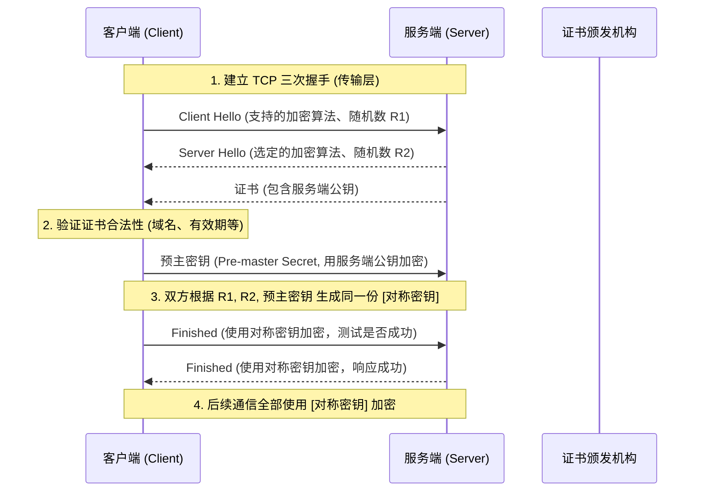

## WebSocket
基于 HTTP 协议，一旦建立连接，双方即可互相通信

