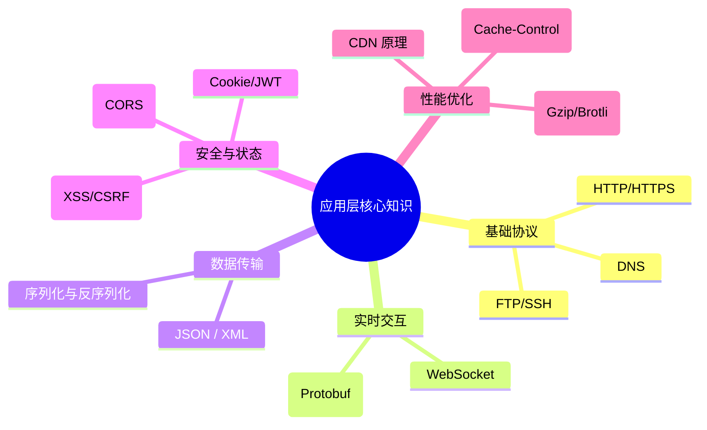
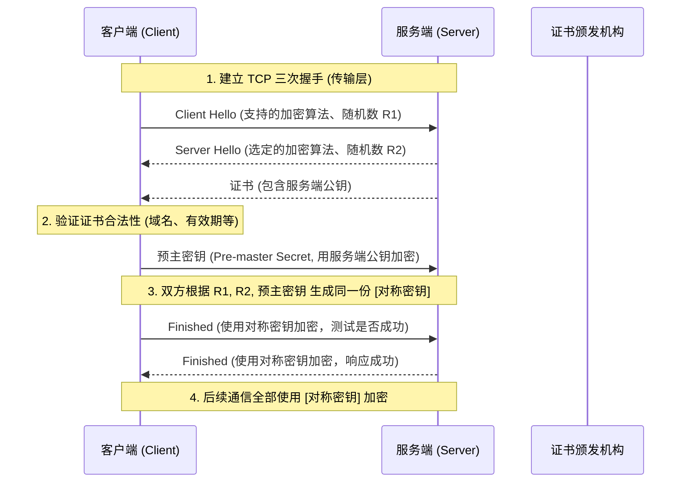
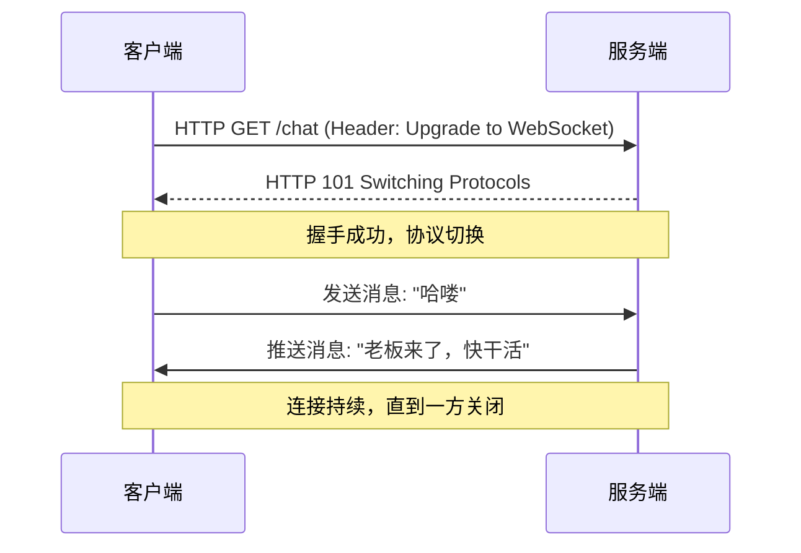
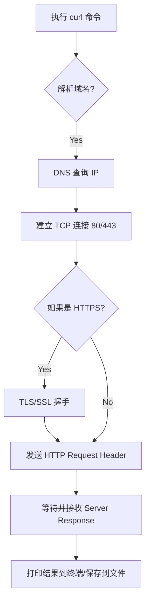

# 基础架构


# 网络接口层
>  实际上功能类似于 ： 物理层 + 数据链路层

## 物理层
>  数据格式： bit 流（比特流）

*信道*
- 信噪比 = 信号平均功率 / 噪声平均功率 （分贝 dB）
- 香农定理 - 信道的噪声越大，信道的极限传输速率越高

*传输设备*
- 引导型
	- 双绞线
	- 同轴电缆
	- 光纤
- 非引导型
	- 无线电波
	- 微波信号

## 数据链路层
>   数据格式： 帧

作用： 
1. 封装成帧
2. 差错检测 - 采用*循环冗余校验（CRC）*
3. 透明传输 - 所有的数据都能传输，没有特殊字符不能传递

## 帧的格式


这里需要注意的是，以太网 802.3 规定了*最大传输单元（MTU = 1500 B）* 
所以帧的数据不能超过 MTU

*MAC 地址*
- 长度： 48 位 - 通常用 6 组 16 进制来描述
- 唯一性： 出产时，固化在网卡的 ROM 上
- 作用： 在局域网唯一标识某台主机

## MAC 帧格式
长度： `662N4`


# 网络层
>  数据格式：IP 数据报

作用： 
- 异构网络互联 - 以太网（802.3）可以与 Wifi（802.11）不是一个协议 - 路由器
- 路由与转发 - 路由器
- 拥塞控制 - 也是通过路由器控制

## IP 协议
>  网络层最最最重要的东西之一
- 长度： 32 b
- 写法： CIDR - 点分十进制 - <网络前缀>，<主机号>
	- 例如： `198.1.1.1/24` - 说明前 20 位为网络号，后 12 位为主机号
- 子网掩码： 用于快速判断两个 IP 地址是否处于同一网络中
	- 若是 CIDR 写法 - 前 20 位为 1，后 12 为 0  - `255.255.255.0`
	- 判断两个 IP 是否属于同一网络
		- 先算出`子网掩码 & IP 地址`，若相同则为同一网络
- *与 IP 相关的协议*
	- `ARP`：地址解析协议 - 用于在局域网找到目标 IP 的 MAC 地址
	- `ICMP`：网际控制报文协议 -  为了提高有效转发 IP 数据报与交付成功的机会
	- `IGMP`：国际组管理协议
	- `DHCP` : 用于动态分配地址（应用层协议）

## IP 数据报格式


### 各字段解释
*协议*： 4 bit  --- ipv 4 / ipv 6
*首部长度* ： 4 bit  --- 首部区间[20, 60] --- 20： 固定长度 --- 60： 固定长度 + 可选字段
*区分服务* ： 8 bit --- 用于标识数据报的优先级和服务质量
*总长度* ： 16 bit --- 首部 + 数据报长度（理论上 ip 数据报最长可达到：65535 B 但因为，MTU 限制 1500 B 所以超过 1500 B 就需要分片传输）
*标识* ： 16 bit --- 每产生一个数据报，计数器就加 1。当数据报由于长度超过 MTU 而必须分片时，这个标识字段的值就会被复制到所有的数据报片的标识字段中。相同的标识字段的值使分片的各数据报片最后能正确的组装成原来的数据报。
*标志* ： 3 bit --- 最低位 MF = 1 -> 还有分片； MF = 0 -> 这是最后一个分片
		   --- 中间位 DF = 1 -> 不能分片；DF = 0 -> 运行分片
*片偏移* ： 13 bit --- 某片在原分组中的相对位置 （起始位置 / 8） --- 每段分片都需要带上首部
*生存时间 TTL* ： 8 bit --- 表明了数据报在网络中的寿命 --- 每经过一个路由器，值会减一，为 0 时丢弃该数据报
*协议* ： 8 bit --- 数据报携带的数据是那种协议（TCP/UDP/ICMP...）
*首部检验和* ： 16 bit --- 只检验首部
*源地址* ： 32 bit
*目的地址* ： 32 bit

### IP 转发
步骤 1： 
	判断目标主机 IP 是否在同一网络中 ---> `目标IP & 子网掩码 != 源IP & 子网掩码 `
								 说明不在同一网络，需要路由器转发
步骤 2： 
	转发到网关路由器，到网络层 ---> 判断转发表 `前缀IP & 子网掩码 == 源IP & 子网掩码` ---> 转发到下一跳地址  

## NAT
>  网络地址转换

### NAT 分类
#### 静态 NAT
一对一的关系，一个内网的 IP 只能映射一个外网的 IP，地址映射关系保持不变（上图描述的就是这种关系静态 NAT）

常见应用：
+ web 服务器
+ 邮件服务器
+ 需要对外访问的服务


当然，这里需要注意一下，
- 按现实情况，路由器存放的是 NAPT 表（加了端口的转换）
- 外网不能直接访问内网主机，对于主机 B 而言，主机 A 的内网地址不是透明的，不能直接 -> 源地址 : 134.3.3.3 目的地址：192.168.0.1  路由器是不会理睬这个 IP 数据报的，因为目的 IP 不是自己的 IP

#### 动态 NAT
动态 NAT 使用 IP 地址池，可将多个私有 IP 地址映射到一个或多个公有 IP 

工作原理
-  当内网主机发起访问时，NAT 设备从 **地址池** 中选择一个公网 IP 进行映射。
-  连接结束后，该公网 IP 释放，可供其他主机使用。


#### PAT
将 **多个私有 IP 地址通过不同端口映射到同一个公有 IP**
原理：
- 内网主机访问外网时，NAT 设备将 **IP 地址+端口号** 转换为 **公有 IP 地址+不同端口号**。
-  返回数据时，通过记录的端口号映射回正确的内网主机。


## ARP


*为什么需要 ARP 协议呢？*
在主机通信中，网络层只能知道对方 IP，同理，网络接口层只能得知对方的 MAC
这里就有一个问题，在同一局域网下，主机 A 要给主机 B 发送消息（A 只知道 B 的 IP ，而不知道对方的 MAC 地址，不知道发给谁？）

ARP 在局域网内，可以通过 IP 地址得到对应的 MAC 地址

*原理*

ARP 请求 -> 局域网内**广播** -> 询问目标 IP 的 MAC 地址
		主机接收到请求，查看目标 IP 是否是自己
			- 若是 - ARP 响应 -> 目标主机将自己的 MAC 地址发送给源主机 (单播帧)
			- 若不是 - 丢弃

当然每台主机上，都会维护一个 ARP 高速缓存表（ARP cache），发送请求前，先查表，若没有则走 ARP 请求分组，ARP 响应分组回来后，将获取的 MAC 地址加入到缓存表中

每一个映射地址都会设置生存时间，若超过生存时间，则在表中删除


## ICMP
- ICMP *差错报告*报文
	- 3 -- 终点不可达
	- 11 -- 时间超时（TTL 为 0）
	- 12 -- 参数问题
	- 5 -- 改变路由
- ICMP *询问*报文
	- 8/0 -- 回送请求或回送回答
	- 13/14 -- 时间戳请求或时间戳回答

不应该发动 ICMP 差错报文的几种情况：
1. 对于 ICMP 差错报文，不再发送 ICMP 差错报文
2. 对于分片数据报
3. 对于多播地址数据报（224.0.0.0~239.255.255.255）
4. 对于特殊地址（127.0.0.1 / 0.0.0.0）

---
ICMP 的实际例子
- `ping` 命令 (回送请求报文) --- `ping ip/domain` 不要加协议（协议属于应用层，ping 属于网络层）


## 路由协议
### 静态路由 VS 动态路由
|类型|定义|工作原理|
|---|---|---|
|**静态路由**|管理员**手动配置**的路由条目，路径固定不变|路由器直接查表转发，不与其他设备交换路由信息|
|**动态路由**|路由器通过**路由协议自动学习**并维护路由表|路由器之间定期/触发式交换网络拓扑信息，自动计算最优路径|

### 动态路由协议

*RIP* 
适用于： < 15 跳的小型网络

原理：
1. 每 30 秒向邻居**广播**整个路由表
2. 收到路由后，跳数+1，选最小跳数路径
3. 180 秒未更新则标记不可达

*OSPF*
适用于： 中大型企业网/园区网

原理：
1. 建立邻居 → 同步链路状态数据库（LSDB）
2. 每台路由器用 Dijkstra 算法计算最短路径树
3. 仅当拓扑变化时触发更新（非定期泛洪）

*BGP*
适用于： 云服务商互联

原理：
1. 基于 TCP（端口 179）建立可靠邻居关系
2. 交换 NLRI（网络层可达信息）+ 路径属性
3. 通过策略引擎（Policy）决策最优路径

# 传输层
>  数据格式： 报文段

传输层的一个重要概念 *端口 16 bit(最大 65535)*  ---> *复用* 与 *分用*
应用层的每个进程，都会有一个端口来接收和传输数据

服务端： 1 - 1023
客户端： 49152 - 65535

*复用* ： 共同使用一个协议
*分用* ： 网络层接收到 IP 数据报时，提取数据部分，根据首部的目的端口号，分发到不同端口

### TCP
>  传输控制协议 

特点：
+ 面向连接 
	+ 通信前必须先建立 TCP 连接
	+ 传输数据
	+ 释放 TCP连接
+ TCP 连接是一对一通信（TCP 连接只能有两个*端口（不是网络层的概念，而是套接字 socket （IP 地址： 端口） ）* ）
+ 可靠服务：无差错、不丢失、不重复、有序
+ 全双工通信（可互发信息，有缓存）
+ 面向字节流

TCP 发送报文段时，会根据对方给出的窗口值和当前网络拥塞程度，来决定一个报文段应包含多少字节 --> 若应用程序传送到 TCP 数据块太大 --> TCP 会拆分成更小的数据库；若一次只有一个字节，那么 TCP 会等待积累足够多的字节才传送

而 UDP 发送的报文长度时应用程序决定的

#### 可靠传输
理论上：
+ 信道传输中不应该发生差错 -> 发生差错时让发送方重传发现错误的数据
+ 不管发送方以多么块的速率发送信息，接收方都来得及处理数据 -> 当一方来不及处理数据，另一方降低数据发送速率

---
超时重传、累积确认、序号 seq、确认号 ack

*停止等待协议*
发送方发送一次信息给到接受方，接收方需要发送*确认收到* 的回信给到发送方
发送方接收到回信后，才会发下一次

*超时重传*
发送方在发送消息时，会在本地启动*超时计时器*，若接收方未在时间范围内将*确认分组* 的回信，发送给发送方
那么发送方会重新发送一遍上次分组数据
  
这里需要注意：
+ 发送方，需要备份分组数据
+ 分组/确认分组需要编号

*确认丢失*
即确认分组回信丢失，发送方会做两个动作
+ 丢弃重复分组
+ 接收方向发送方发送确认分组

*确认迟到*
确认分组回信，发送了，但是迟到了（超过了发送方的超时时间）
等发送方接收到信息时，那么发送方会丢弃迟来的信息

*累积确认*
接收方只需对按序到达的最后一个分组发送确认分组信息

#### TCP 首部格式
固定 20 B


*序号 seq* ： 用于记录第一个字符在字节流中的位置
*确认号 ack* ： 期望收到对方下一个报文段的第一个数据字节的序号（ACK = 1，才启用）
*数据偏移* ： 4 bit 首部的长度
*保留* ： 6 bit 保留字段
*UBG* ：紧急 UBG = 1，紧急指针启用，事态紧急，不需排队
*ACK* ： 确认号 ACK = 1，确认号有效（连接建立后所有传递的报文段都必须 ACK = 1）
*PSH* ： 推送常用于交互式通信 PSH = 1，不需要等到整个缓存满了之后才向上交付
*RST* ： 复位 RST = 1，说明发送方出现严重错误，断开连接
*SYN* ： 同步 SYN = 1，握手 ①② -> SYN = 1 握手① -> ACK = 0，其他都为 0
*FIN* ： 终止 FIN = 1，挥手①③ -> FIN = 1 其他为 0 
*窗口* ： 实现流量控制的关键

#### 拥塞控制
>  拥塞: 在网络传输中，某段时间内，若对网络中某一资源的需求超过了资源所能提供的可用部分，网络的性能就要变坏。

TCP 中提供四种算法，来解决：
+ 慢开始
+ 拥塞避免
+ 快重传
+ 快恢复

具体实现：
慢开始时拥塞控窗口指数增长，到阈值后进入拥塞避免，改为线性增长。如果收到 3 个重复 ACK，会触发快重传并进入快恢复，窗口减半后继续线性增长。

#### 队头阻塞
TCP 只要有一个包丢了，哪怕后续的 2、3、4 包数据都已准备完毕（缓存区），
TCP 也不能将数据交付给上层应用，必须等第一个包重传回来

后话，由于 HTTP 是基于 TCP 的，所以也会有这个问题（[HTTP/3.0 基于 QUIC 协议解决](#HTTP)）

### UDP
>  用户数据报协议

特点： 
+ 无连接的
+ 不可靠的
+ 无序的
+ 可进行一对一、一对多、多对多、多对一的通信

#### UDP 首部格式
UDP 首部长度： 8 B


*源端口* ： 需要对方回信时填写端口号，一般为 0
*目的端口* ： 16 bit
*长度* ： 首部 + 数据的长度
*校验和* ： UDP 在校验时，会加上 12 B 的伪首部进行校验
+ IP 数据报只校验首部
+ UDP 会校验首部和数据部分

# 应用层



## DNS
> 域名解析系统

DNS 是一个*分布式系统*，即使单个计算机出了故障，也不会妨碍其他系统
把待解析的域名放到 DNS 请求报文中，以 *UDP* 的形式发送到 DNS 服务器

## HTTP/HTTPS
+ HTTP 是*无状态*的，也就是，服务端不知道你是谁
	+ 解决方案：
		+ cookie
		+ session -> 在分布式系统中，多台系统不共享
		+ jwt
+ HTTP 是基于 *TCP* 的

### HTTP
部分语言代码实现：[AJAX](../front-tech/AJAX.md)

*HTTP/1.1* ： 持续连接 **keep-alive** （区别于 http 1.0 非持续连接 -> 每次请求文档，都需要建立 TCP 连接）；http 1.1 TCP 连接不断；
有两种工作方式：
+ 非流水线 -> 类似于*请求等待协议*，需要等待上一次响应返回后，才能发送下一次请求
+ 流水线 -> 客户端可连续发送请求，无须等待服务端响应

*HTTP/2.0* ：引入了 **二进制分帧** 和 **多路复用（并行响应）** 
+ 二进制分帧 -> 压缩请求/响应 http 报文首部字段，不发送重复的报文首部
+ 多路复用 -> 
	+ 原因： http 1.1 流水线模式下，虽然客户端可连续发送请求，但是服务端响应是按顺序发送响应的。只要有一个响应出现问题，那么会造成后续响应都延时发送
	+ 解决： 并行发送响应，正常响应不会收到阻塞响应的影响

*HTTP/3.0*： 彻底抛弃了 TCP，改用基于 UDP 的 **QUIC 协议**。它解决了 TCP 握手慢和丢包导致的全链路等待问题，是弱网环境下（如移动端切换基站）的神器

---
**<font color="#ff0000">疑问</font>**：
1. QUIC 协议（传输层协议）是什么？
	==快速 UDP 互联网连接== 是一种现代通用传输层网络协议，旨在使网络通信更快、更可靠且更安全
	特点：
	+ 基于 UDP 构建（但是重写了一套 ACK 和重传机制，实现 TCP 靠谱的机制）
	+ **快速握手**: 更快的握手，传输、加密和握手合并为一
	+ **连接迁移**: TCP 靠“四元组”（源IP、源端口、目的IP、目的端口）识别连接，你从 Wi-Fi 切换到 5G，IP 变了，TCP 就断了。**QUIC 使用 Connection ID（连接 ID）**，只要 ID 不变，哪怕你 IP 变了，连接依然无缝继续
	+ **无头端分流的复用**: 通过在单个连接中创建多个独立的流，每个流单独处理丢包重传。流 A 丢包了，只影响流 A，流 B 照样跑 

2. 弱网环境是什么？
	- **高延迟（High Latency）**：Ping 值几百毫秒，点一下转半天圈
	- **高丢包（High Packet Loss）**：发 10 个包丢 3 个，导致 TCP 频繁重传，速度骤降
	- **频繁切换/断连**：比如你在电梯里、地铁过隧道、或者 Wi-Fi 和 4 G 信号反复横跳

在弱网下，QUIC 的*快速握手*（0-RTT）和*连接迁移*优势就会体现得淋漓尽致，这就是为什么抖音、视频通话等应用极度依赖 QUIC

#### HTTP 报文结构
*请求报文*
```
<请求行>  ==>  GET /index.html HTTP/1.1
<请求头字段1>: <值1>
<请求头字段2>: <值2>
...
(空行)
<请求体>  # 可选，如POST请求的表单数据
```

请求方法
1. GET： 获取资源
2. POST： 携带信息请求资源
3. PUT：*全量*更新资源
4. DELETE： 删除某个资源
5. OPTIONS： 询问服务器支持的方法
6. HEAD： 获取资源的响应头
7. PATCH： 修改*部分*资源

*响应报文*
```
<状态行>  ==> HTTP/1.1 200 OK
<响应头字段1>: <值1>
<响应头字段2>: <值2>
...
(空行)
<响应体>  # 可选，如HTML内容、API返回数据
```

常见状态码：
101：Switching Protocols 升级协议
200：OK 资源获取成功
301：Moved Permanently 永久重定向
302：Found 暂时重定向
304：Not Modified 资源未修改，使用缓存
400：Bad Request 请求格式错误
401：Unauthorized 未认证，需登录
403：Forbidden 权限不足
404：Not Found 资源不存在
405：Method Not Allowed 不支持的方法
500：Internal Server Error 服务器内部错误
502：Bad GateWay 网关错误
503：Service Unavailable 服务器过载/维护

#### 缓存机制
分为两种，协商缓存和强缓存

*协商缓存*
>  若客户端资源过期，需要发送请求向服务端确认资源是否更新
>  若*未更新*，服务器返回 304，客户端使用*本地缓存*，若*已更新*，返回 200 和已更新资源

 `Last-Modified / If-Modified-Since`
- 服务器响应时通过 `Last-Modified` 返回资源最后修改时间：`Last-Modified: Tue, 15 Nov 2022 12:45:26 GMT`。
- 客户端下次请求时，通过 `If-Modified-Since` 携带该时间：`If-Modified-Since: Tue, 15 Nov 2022 12:45:26 GMT`。
- 服务器对比：若资源未修改，返回 304；否则返回新资源和新的 `Last-Modified`。  
    _缺陷：无法识别秒级内的修改；资源内容未变但修改时间变了（如重新保存）会误判为更新_

`ETag / If-None-Match` 
- 服务器响应时通过 `ETag` 返回资源的**唯一标识（如哈希值）**：`ETag: "abc123"`。
- 客户端下次请求时，通过 `If-None-Match` 携带该标识：`If-None-Match: "abc123"`。
- 服务器对比：若标识一致（资源未变），返回 304；否则返回新资源和新的 `ETag`。  
    _优势：比 Last-Modified 更精准，可识别内容未变但时间变的情况_

*强缓存*
>  客户端直接使用缓存，无需向服务端（发送请求）询问

由 `Expries(HTTP/1.0)` 或 `Cache-Control(HTTP/1.1)` 控制
+ Expries
	服务器会发送一个 GMT 时间给客户端，是*绝对*时间
	但是，这有一个坏处，如果客户端时间有问题，那么就可能导致缓存出现偏差

+ Cache-Control
	要由 `max-age(秒)` 来控制缓存时间，是*相对*时间
	还有其他的一些属性：
	- No-cache：发起协商缓存
	- No-stroe：禁止任何缓存
	- Public：允许中间代理 CDN 缓存
	- Private：仅客户端可缓存

### HTTPS
`HTTPS = HTTP + TLS/SSL`
其核心在于解决三个问题：
+ **机密性（加密）**
+ **完整性（防篡改）**
+ **身份认证（CA 证书）**




## 鉴权手段
>  由于 http 协议是无状态的，服务器不记录用户状态
>  所以出现了下面三种鉴权手段

在开始之前，我们需要高情况一个概念 *token*
*token（令牌）* 是一个笼统的概念，它是遗传能够代表某种权限身份的字符串（也就是说它根本不是一种具体的技术） 

通常 **Session 依赖 Cookie** 传输，而 **JWT 是一种特殊的 Token**
### cookie 
>  浏览器的一种存储机制，服务器可*通过 HTTP 设置响应头*来开启 cookie (通常不超过 4 kb)
+ 优点：浏览器自动管理，无需开发者手动存储
+ 缺点：跨域限制，容易收到 CSRF 攻击

服务端设置 `set-cookie` 

| **属性**                | **作用**   | **备注**                                                 |
| --------------------- | -------- | ------------------------------------------------------ |
| **Name/Value**        | 名字和值     | 比如 `session_id=abc123`。                                |
| **Domain**            | 域名范围     | 决定哪些网站能看这个 Cookie。设置 `.baidu.com` 则子域名也能用。             |
| **Path**              | 路径范围     | 比如设置 `/blog`，那么访问 `/index` 时就不会带上它。                    |
| **Expires / Max-Age** | 有效期      | 决定它是“会话级”（关浏览器就消失）还是“持久级”（存到硬盘）。                       |
| **HttpOnly**          | **安全防护** | **极其重要！** 设置后，JavaScript 无法读取 Cookie，能有效防止 **XSS** 攻击。 |
| **Secure**            | 安全传输     | 设置后，只有在 **HTTPS** 连接下才会发送该 Cookie。                     |
| **SameSite**          | 跨站限制     | 决定 Cookie 是否随跨站请求发送。用于防范 **CSRF** 攻击。                  |


### session 
>  用户登录后，服务器会在内存或数据库中存储一个 session 对象，然后把 sessionId 通过 cookie 发给浏览器
+ 优点： 安全性高，数据都存放在服务端，客户端只有一个 id
		控制力强，服务器可以随时踢人下线（删除 sessionId）
+ 缺点： 用户多了，服务器压力大
		如果你有*多台服务器*做负载均衡：
		- 用户在服务器 A 登录，Session 存在 A 的内存里
		- 下一次请求被转发到了服务器 B
		- 服务器 B 的内存里没这个 ID，于是提示用户“请重新登录”
		- **解决方法**：必须引入 **Redis** 或 **Memcached** 做全局共享存储

流程：
用户登录 --> 服务端生成唯一 sessionID --> 通过 set-cookie 方式传递给客户端 --> 下一次客户端访问时自动携带 sessionID --> 服务端查询 sessionID 即可知道用户是谁

```js
const express = require("express");
const session = require("express-session");

const app = express();

app.use(session({
	secret: "your_secret", // 用于加密 cookie 的字符串
	resave: false, // 强制保存 session 即使它没修改
	saveUninitialized: true, // 强制将未初始化的 session 存储
	cookie: { maxAge: 60000,  httpOnly: true  }
}))

app.post('/api/login', async (req, res) => {
	const {username, password} = req.body;
	if (!username || !password) {
		res.status(200).json({ // http响应状态为 200 -> http传输没有问题
			code: 50000,  // 业务逻辑有问题
			sucess: false,
			message: "必须填写用户名或密码"
		})
	}
	
	// 一系列业务逻辑判断 xxx
	
	const user = await loginService.findUserByUsername({ username });
	
	req.session.userId = user.id;
	req.session.username = user.username;
})

app.listen(3003, () => {
	console.log("服务在 3003 端口运行")
})
```


### Jwt 
>  服务端不存放任何数据，将用户信息加密成一个字符串发给客户端，客户端存储起来，下次请求携带，服务器解密即可知道你是谁
+ 优点： 服务器不需要查数据库或内存、跨平台
+ 缺点： 一旦发出，除非过期，否则服务器很难让它立即失效

Jwt 格式：
`header.payload.signatrue`

+ `header` 头部部分
	一般是固定的，记录加密算法以及使用的 token 类型
```json
	{ "alg": "HS256", "typ": "JWT" }
```

+ `payload` 负载部分
	记录用户的基本信息，但注意这块不是加密的，是由 base 64 编码，不要放敏感信息
```json
	{ "sub": "1234567890", "name": "John Doe", "admin": true }
```

+ `signatrue` 签名部分
	由 `header + payload + 服务端密钥` 加密出来的签名，如果中间人改了 Payload 里的 `admin: false` 为 `true`，由于他没有密钥，生成的签名就对不上，服务器一眼就能识破

```js
const express = require("express");
const jwt = require("jsonwebtoken");

const app = express();

// 一般来说 login 接口是 post -> 数据库查找用户 -> 设置 token - 返回
app.get("/login", (req, res) => {
	const user = {username: "admin", password: "12324345"};
	
	// jwt这个库简化了加密过程，不用手动加密header，只用传用户数据和密钥即可
	const token = jwt.sign(user, process.env.SECRET_KEY, {expiresIn: '1h'}
	res.status(200).json({sucess: true, token: token})
})

--->
// 前端一般将 jwt token 存储于 localStorage
// 发送请求时，在 headers 中携带自定义请求头 Authorization: Bearer <token>

// 验证用户信息 
app.get('/profile', (req, res) => { 
 	const header = req.headers['authorization'];
 	const token = header?.split(' ')[1];
 	
 	if(!token) return res.status(401).json({sucess: false, message: "无权限"});
 	
 	// 判断密钥是否正确
 	// jwt这个库校验步骤也简化了，应该是拿到token中的header和payload的部分重新加密的，生成的密钥与客户端传来的密钥比较是否一致
 	jwt.verity(token, process.env.SECRET_KEY, (err, user) => {
 		if (err) return res.status(403).send('Token 无效或已过期'); 
 		
 		// 解密成功，可以直接拿到用户信息，无需查数据库 
 		res.json({ message: '验证通过', userData: user });
 	})
}

app.listen(3003, () => {
	console.log("服务运行在 3003 端口")
})
```

流程：
1. 服务端 -- header + payload + 密钥 = 签名（token） --> 客户端（localStorage、cookie 存储）
2. 客户端请求（携带 token） ----> 服务端根据客户端 header + payload + 服务端密钥 =  token 判断是否与客户端传输的签名是否相同 
	1. 相同 --- 给响应
	2. 不相同 --- 401


### Jwt 过期时间
与 session 相比，jwt 处理黑名单用户是否困难（session 只需在服务器找到用户信息，删除即可；但 jwt 不行，服务器没有存储用户信息） --- 双 token 模式，将 refresh_token 加入数据库

 Jwt 是无状态的，只要签名有效，就认为用户已登录
解决方案： 给 jwt 加上*过期时间 exp* , 存储在 `payload` 字段中

```js
// payload 格式
{
  "sub": "1234567890",
  "name": "John Doe",
  "iat": 1516239022,  // 签发时间 (Issued At)
  "exp": 1712588000   // 过期时间 (Expiration Time)
}
```

服务端校验：
1. Token 是否被篡改，使用客户端传的 header + payload + 服务端密钥重新计算签名，与客户端传的签名进行比较
	1. 相同，判断 token 是否过期 —— 服务端当前时间 > exp  => 过期
								服务端当前时间 <= exp  => 未过期 => 正常响应
	2. 不相同，返回 401

但，这样也会有问题，如果用户在操作过程中，过期时间到了，需要重新登录，这样用户体验太不好了
主流解决方案： *无感刷新（双 Token 机制）*

通过 `access_token` 和 `refresh_token` 配合 —— 这种方案需要前端配合
+ `Access_Token(AT)` 寿命短（15-30 分钟）
	+ 用于 API 请求
	+ 存储内存或浏览器的非敏感区域（localStorage）
+ `Refresh_Token(RT)` 寿命长（7-14 分钟） —— 一般存储在*数据库*中
	+ 唯一用途： 当 AT 过期后，找后端换一个新的 AT
	+ 存储在 `HttpOnly` 的 cookie 中

无感流程：
1. 正常请求（携带 AT）
2. 服务端校验 -- AT 过期 -- 返回 401
3. 前端拦截 401 错误 -- 发现是 AT 过期
4. 静默续期 -- 前端发送特殊 `/refresh` 接口，把 RT 发给后端
5. 后端校验 RT 是否有效 -- 有效返回新的 AT
6. 重新请求 -- 前端拿到新 AT 后，重新请求刚才失败的请求

代码实现： [双 token 流程](../front-tech/场景/双%20token%20流程.md)


## WebSocket
基于 HTTP 协议，一旦建立连接，双方即可互相通信
通信过程：
1. 客户端发送特殊 HTTP 请求报文给到服务端 
   请求头携带： `Upgrade: websocket`
2. 若服务端支持 websocket，那么升级协议，返回 `101 Switching Protocols`
3. 双工通信，从此这个 TCP 不在遵循 HTTP 规范




## RPC
Remote Procedure Call
核心目的： 让你能像调用本地函数一样，去调用远程服务器上的函数/方法，而不需要关系底层网络通信细节

经典交互流程：
1. 客户端调用
2. 序列化： 参数转换成网络传输支持的二进制格式（json）
3. 网络传输： TCP/HTTP
4. 反序列化： 服务端将数据还原
5. 本地执行： 服务端执行真正的业务逻辑
6. 返回结果： 按原路径序列化返回给客户端

RPC 关键要素：
+ 序列化协议 —— 如何转化为二进制？
+ 通信协议 —— 如何传递数据？
+ 服务注册与发现 —— 调用方怎么知道服务端在哪？

### `tRPC`
[tRPC](https://trpc.io/?try=next-minimal-starter#try-it-out)
利用 TypeScript 类型推断，解决 REST 或 GraphQL *类型不同步*问题

1. 定义路由： 在后端定义好所有可用的函数（Procedures），使用 `query` 获取数据，`mutation` 修改数据
2. 类型导出 `import type`
3. 前端消费: 引入 tRPC Client

在 Nextjs 中使用： [tRPC](https://trpc.io/docs/client/nextjs/app-router-setup)

#### Quick Start
*Define tRPC*
```ts
import { initTRPC } from "@trpc/server";

const t = initTRPC.create();

export const router = t.router;
export const procedure = t.procedure;

export const appRouter = router({
	hello: procedure.query(() => "hello trpc!")
})

export type AppRouter = typeof appRouter;
```

*tRPC Adapters*
```ts
// app/trpc/[...trpc]/route.ts

import { fetchRequestHandler } from "@trpc/server/adapters/fetch";
import { appRouter } from "@/app/trpc/routes/_app";
import { NextRequest } from "next/server";

const handler = (request: NextRequest) => {
  return fetchRequestHandler({
    endpoint: "/api/trpc",
    req: request,
    router: appRouter,
    createContext: (() => {})
  });
};

export { handler as GET, handler as POST };
```


*tRPC Client*
```ts
import { createTRPCClient, httpBatchLink } from "@trpc/client";
import type { AppRouter } from "../app/trpc/routes/_app";

export const client = createTRPCClient<AppRouter>({
  links: [httpBatchLink({ url: "http://localhost:3000/api/trpc" })],
});
```

*Usage*
```js
import {client} from "api";

useEffect(() => {
	client.hello.query().then((res) => console.log(res));
})

```


#### Define Context
>  输入进 context 中的数据，会被所有的 procedure 函数共同访问

作用： 鉴权 —— 有些 api 需要用户登录后才能使用

```js
// 声明 context
const t = initTRPC.context<T>().create();

// 构建 context


// 注入
const handler = (request: NextRequest) => {
  return fetchRequestHandler({
    endpoint: "/api/trpc",
    req: request,
    router: appRouter,
    createContext: context
  });
};
```

### Middlewares


### `gRPC`
 `gRPC` 的使用场景
你可能觉得 `JSON + HTTP` (REST) 已经很完美了，但在大厂的**内部微服务**之间，它太慢了

**gRPC 的核心：高效 + 强契约**
- **场景一：微服务“内卷”**。一个大系统拆成了几百个小服务。如果用 JSON，每秒几万次请求，光是解析字符串、传输冗余的 Key 就会掉大量的 CPU 和带宽。GRPC 用 **Protobuf**（二进制），快得飞起。

- **场景二：多语言合作**。公司里有的组用 Go，有的用 Java，有的用 Python。GRPC 让你写一个 `.proto` 定义文件，直接自动生成各语言的通信代码。你调用远程服务就像调用本地函数一样简单。


## `curl`
>  curl 命令，方便开发者进行调试

### GET 
`curl https://www.example.com`

输出结果打印在终端

选项参数：
+ `-I`  查看*响应头*
  `curl -I https://www.baidu.com` 
```bash
HTTP/1.1 200 OK
Cache-Control: private, no-cache, no-store, proxy-revalidate, no-transform
Content-Length: 0
Content-Type: text/html
Pragma: no-cache
Server: bfe
Date: Fri, 27 Mar 2026 02:17:07 GMT
```

+ `-v` 查看*全过程*
  `curl -v https://www.google.com`
它是调试神器。你可以看到：
1. DNS 解析出的 IP 地址
2. TLS 握手过程中证书的校验
3. 客户端发送的 Header（以 `>` 开头）
4. 服务端返回的 Header（以 `<` 开头）

### POST/PUT/DELETE
在进行 API 开发调试时，我们需要模拟各种请求方法
- **发送 POST 表单数据：** `curl -d "username=admin&password=123" https://example.com/login`
    
- **发送 JSON 数据（最常用）：** `curl -X POST [https://api.example.com/user](https://api.example.com/user) \ -H "Content-Type: application/json" \ -d '{"name": "Gemini", "age": 18}'`
    
   `-H` 用于指定请求头，`-d` 用于指定数据内容
    
- **上传文件：** `curl -F "file=@/path/to/photo.jpg" https://example.com/upload`

Curl 命令流程




