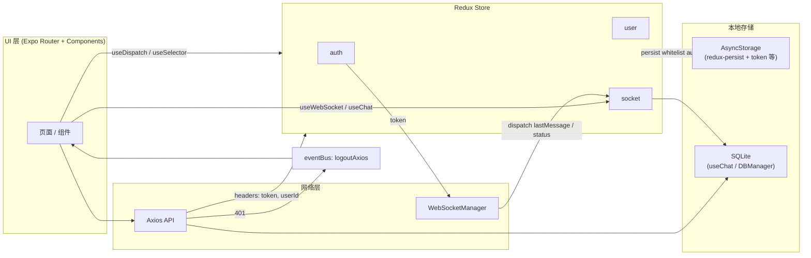
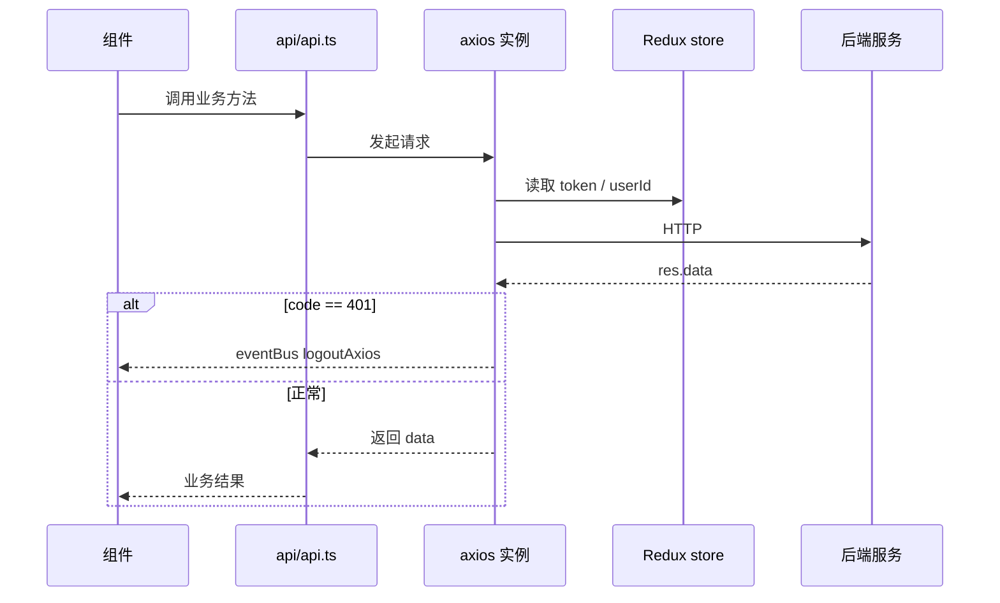

# NihaoTalk（TM-IM）项目分析报告

> 项目路径：`./TM-IM`  
> 技术栈：**React Native 0.81 + Expo SDK 54 + Expo Router 6**，入口 `expo-router/entry`。

---

## 1. 功能概览

本项目为面向企业的 **即时通讯与办公协同** 应用（NihaoTalk），在单一 App 内集成消息、工单、日报、审批、打卡等能力，并与后端 HTTP API、WebSocket 实时通道联动。

| 模块                | 用途简述                                                                                                                                                                  |
| ----------------- | --------------------------------------------------------------------------------------------------------------------------------------------------------------------- |
| **认证与启动**         | `app/login.tsx`、`withAuthGuard`、根布局中的初始化：登录态、字体、闪屏、通知初始化等。                                                                                                            |
| **消息 / 聊天**       | `app/(tabs)/chat`、`app/chatRoom/[id]`、聊天相关 `components/ChatRoom/*`：单聊/群聊、消息列表、输入、富文本（Tiptap）、媒体与历史记录等。                                                                |
| **通讯录与组织**        | `app/contacts`、`app/organizationStructure/*`：组织架构、员工列表、搜索等。                                                                                                           |
| **工单**            | `app/(tabs)/task`：工单 Tab 入口。                                                                                                                                          |
| **日报**            | `app/(tabs)/reports`、`app/(reports)/dailyRecordDetail`、`components/dailyRecord/*`：日报列表与详情、评论等。                                                                        |
| **审批**            | `app/(tabs)/approval`、`app/(approval)/approvalDetail`、`components/Approval/*`：审批列表与详情流程。                                                                              |
| **考勤 / 打卡**       | `app/(tabs)/attendance`、`components/Attendance/*`、相关 hooks（如 `useGetAttendanceInfo`）。                                                                                 |
| **个人与设置**         | `app/profile`、`app/userInfo/*`、`components/ProFile/*`：个人信息、同步、退出等。                                                                                                    |
| **Ding / 强提醒类消息** | `app/utilsComponents/dingMessage*`、`components/DingMessage/*`：叮消息发送、接收、弹窗与选人等业务。                                                                                      |
| **全局基础设施**        | 通知（`utils/NotificationManager`）、WebSocket（`utils/SocketManager`）、本地库（`expo-sqlite` + `hooks/useChat`）、HTTP（`api/axios.ts` + `api/api.ts`）、跨组件事件（`utils/eventBus.ts`）。 |

### 1.1 模块间依赖关系（概念）

- **所有业务页** 依赖 **路由壳**（`expo-router` 的 `app/_layout.tsx`、Tabs 布局）与 **全局 Redux**（认证、用户信息、Socket 摘要状态）。
- **聊天 / 同步** 强依赖 **WebSocket** → 消息落 **SQLite**（`useChat`、`DBManager`），并与 **REST API**（历史同步、业务接口）配合。
- **审批 / 日报 / 工单** 等模块主要走 **REST**，部分场景通过 **eventBus** 与选人弹窗、聊天能力联动。
- **401 登出**：Axios 响应拦截 → `eventBus.emit('logoutAxios')` → 根布局 `InitComponent` 内清理 token、断开 WS、dispatch `logout`。

---

## 2. 项目构建方式

### 2.1 `package.json` 要点

- **入口**：`"main": "expo-router/entry"`，使用 **文件式路由**（`app/` 目录）。
- **脚本**：
  - `start`：`expo start` 开发。
  - `web:build`：`expo export --platform web`（带 `--dev --no-minify`，偏调试/非生产压缩的 Web 导出）。
  - `android` / `ios`：`expo run:android` / `expo run:ios`（需本地预构建或 Dev Client）。
  - `dev:desktop` / `*build:desktop`：进入 `tauri` 目录执行 **Tauri**（桌面壳）；若本地无 `tauri` 目录需单独补齐。

### 2.2 `app.json`（Expo 配置）要点

- **应用名**：NihaoTalk，`slug`: `tm-im`。
- **新架构**：`newArchEnabled: true`。
- **环境相关 URL**（`expo.extra`）：`API_BASE_URL`、`SOCKET_BASE_URL`（与 `constants/config.ts` 通过 `expo-constants` 读取一致）。
- **EAS / OTA**：`extra.eas.projectId`、`runtimeVersion`、`updates.url` 指向 Expo Updates 服务。
- **平台**：iOS `bundleIdentifier`、`buildNumber`、后台音频/定位、Wi‑Fi 信息 entitlement；Android `package`、`google-services.json`、较多定位与前台服务类权限。
- **Web**：`bundler: "metro"`，`output: "static"`。
- **插件**：`expo-router`、图片选择、启动屏、音视频、通知、字体、`expo-sqlite`（Android 开启 FTS 等）、`expo-location`（含后台定位配置）、`expo-asset` 等。

### 2.3 `metro.config.js`

- **仓库根目录默认无 `metro.config.js`** 时使用 **Expo 默认 Metro 配置**。

### 2.4 `babel.config.js`

- `babel-preset-expo`
- `babel-plugin-react-css-modules`：为 `.css` 生成 scoped 类名，配合 **Sass**（`package.json` 中有 `sass`）用于 Web / 富文本编辑器等场景的样式隔离。

### 2.5 `eas.json`

- **development**：Dev Client、内部分发、`development` channel。
- **preview**：内部分发、Android APK、`preview` channel。
- **production**：自动递增版本、Android APK、`NPM_CONFIG_LEGACY_PEER_DEPS`、`production` channel。

### 2.6 构建流程（简述）

1. 日常开发：`npm run start`，配合 **expo-dev-client** 做真机/模拟器调试。
2. 原生变更或插件变更：通过 **EAS Build** 或 `expo prebuild` + 本地 `run:android` / `run:ios` 生成原生工程。
3. JS 资源更新：依赖 **expo-updates**（`runtimeVersion` 与 `updates.url` 对齐策略）。
4. Web：`web:build` 导出静态资源。
5. 桌面：`tauri` 脚本（若目录存在）将相关前端包进 Tauri 壳。

---

## 3. 核心数据流

### 3.1 状态管理

| 方案 | 用途 |
|------|------|
| **Redux + RTK** | `configureStore`（`store/index.ts`），`combineReducers`：`auth`、`user`、`socket`。 |
| **redux-persist** | `persistReducer` 挂载在 root，`whitelist: ['auth','user']`（**不持久化 `socket`**）。存储引擎为 **AsyncStorage**。`persistor` 已创建；根布局未使用 `PersistGate`，持久化仍在 reducer 层生效。 |
| **Zustand** | **未使用**（依赖中无 `zustand`）。 |
| **React Context** | 未发现项目级大规模 `createContext` 模式；全局状态以 **Redux** 为主。 |

### 3.2 组件通信方式

1. **Redux**：`useSelector` / `useDispatch`，根组件 `Provider store={store}`。
2. **mitt 事件总线**（`utils/eventBus.ts`）：跨组件/跨模块事件（如 `logoutAxios`、选人弹窗、群设置变更等），类型在 `Events` 中集中声明。
3. **单例 WebSocket 管理器**（`utils/SocketManager.ts`）：连接生命周期、心跳；收到消息后 `dispatch` 更新 `socket` slice。
4. **Expo Router**：页面间以路由与 URL 参数传递为主。

### 3.3 API 调用流程与数据存储

**HTTP**

- 封装：`api/axios.ts` 使用 `axios.create`，`baseURL` 来自 `constants/config.ts`（读取 `expo-constants` → `app.json` 的 `extra`）。
- 请求拦截：从 **Redux store** 读取 `token`、`userId` 等写入 headers。
- 响应拦截：`code === 401` 时 `eventBus.emit('logoutAxios')`；成功路径返回 `res.data`。
- 具体接口：`api/api.ts` 聚合业务 API 方法。

**WebSocket**

- 登录后 `InitComponent` 中 `wsManager.connect(SOCKET_BASE_URL, token)`。
- 消息解析后写入 **Redux `socket.lastMessage`**，由 `useWebSocket` 等消费；聊天持久化逻辑在 `_layout` 与 `useChat` 中处理（消息同步进 **SQLite**）。

**本地存储**

| 存储 | 用途 |
|------|------|
| **AsyncStorage** | Redux 持久化（auth/user）、设备 UUID、token 清理等。 |
| **expo-sqlite**（`nihaotalk.db`，见 `utils/DBManager.ts` / `hooks/useChat.ts`） | 聊天记录等本地数据库（与 WS/API 同步配合）。 |

**说明**：`expo-secure-store` 在依赖列表中；若需更高安全级别的 token 存储，可考虑统一迁移（改进项）。

### 3.4 数据流 Mermaid 图

**状态与网络（概览）**



**API 请求链（简化）**



---

## 4. 文件结构概览

```
TM-IM/
├── app/                    # Expo Router 路由与页面（文件即路由）
│   ├── _layout.tsx         # 根布局：Redux、字体、闪屏、WS 初始化、全局弹窗
│   ├── (tabs)/             # 底部 Tab：消息、工单、日报、审批、打卡
│   ├── chatRoom/           # 聊天室、群管理、公告、历史等
│   ├── login.tsx           # 登录
│   ├── contacts/           # 通讯录
│   ├── organizationStructure/
│   ├── profile/ / userInfo/
│   └── utilsComponents/    # 路由级工具页（叮消息、选人等）
├── components/             # 可复用 UI（聊天室、审批、日报、通用组件等）
├── api/                    # axios 封装 + 业务 API
├── store/                  # Redux：store、reducers、actions
├── hooks/                  # useChat、useWebSocket、业务 hooks
├── utils/                  # Socket、DB、通知、事件总线等
├── constants/              # 主题色、config（API/WS URL）
├── types/                  # TypeScript 类型定义
├── assets/                 # 图片、字体、音效等
├── app.json                # Expo / EAS / 权限 / 插件
├── eas.json                # EAS Build 配置
├── package.json
├── babel.config.js
└── tsconfig.json
```

---

## 5. 核心依赖包（自动梳理）

以下为对架构影响较大的依赖（**非完整列表**；完整见 `package.json`）。

| 类别 | 包名 |
|------|------|
| 框架 | `expo`、`react`、`react-native`、`react-dom`、`react-native-web` |
| 路由 | `expo-router`、`@react-navigation/native`、`@react-navigation/bottom-tabs`、`react-native-screens`、`react-native-safe-area-context` |
| 状态 | `@reduxjs/toolkit`、`react-redux`、`redux`、`redux-persist` |
| 网络 | `axios` |
| 实时 | 内置 `WebSocket`（经 `SocketManager` 封装）、`mitt` |
| 本地 | `@react-native-async-storage/async-storage`、`expo-sqlite` |
| UI / 交互 | `@expo/vector-icons`、`react-native-gesture-handler`、`react-native-modal`、`react-native-toast-message`、`expo-blur`、`@emotion/react` |
| 富文本 | `@tiptap/*` 系列、`react-native-webview`、`react-native-render-html` |
| 媒体与系统 | `expo-image-picker`、`expo-file-system`、`expo-media-library`、`expo-video`、`expo-audio`、`expo-notifications`、`expo-location`、`expo-updates`、`expo-dev-client` 等 |
| 工具 | `date-fns`、`react-native-uuid` |

**未在依赖中出现**：**TanStack Query（React Query）** — 数据获取以 **Axios + 组件/hooks 内逻辑** 为主。

---

## 6. 自定义原生模块与特殊配置摘要

| 项 | 说明 |
|----|------|
| **新架构** | `app.json` 中 `newArchEnabled: true`。 |
| **无根级 metro.config** | 使用 Expo 默认 Metro；Web 使用 Metro 打包。 |
| **Babel CSS Modules** | `babel-plugin-react-css-modules` + `sass`，用于部分 Web/编辑器样式。 |
| **expo-sqlite 插件** | Android 开启 **FTS**；iOS 带 **自定义 SQLite 编译 flags**（见 `app.json` plugins）。 |
| **推送** | Android `google-services.json`；`expo-notifications` 插件含图标、渠道、后台远程通知等。 |
| **定位与后台** | iOS/Android 均配置了较多定位与前台服务相关权限/能力。 |
| **Tauri 桌面** | `package.json` 脚本指向 `tauri` 子项目；若仓库中无该目录，需单独补齐。 |

---

## 7. 小结

NihaoTalk（TM-IM）是一个 **Expo Router 驱动的多 Tab 企业应用**：**Redux + redux-persist（AsyncStorage）** 管认证与用户摘要，**Axios** 统一 REST，**自研 WebSocket 单例** 推送实时消息并写入 **SQLite**；跨模块协作大量使用 **mitt 事件总线**。构建上依赖 **EAS** 与 **expo-updates**，并启用 **RN 新架构**；Babel 侧为 **Expo 预设 + CSS Modules**。

---

*本文档由项目分析生成，仅作本地说明用途；未随仓库强制提交远程。*
