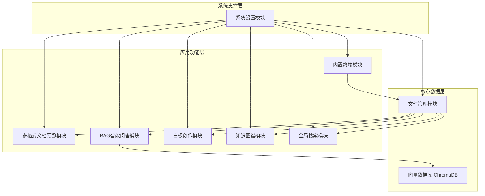

```mermaid
graph TD

A[文件管理模块] --> B[多格式文档预览模块]
A --> C[RAG智能问答模块]
A --> D[白板创作模块]
A --> E[知识图谱模块]
A --> F[全局搜索模块]

C --> G[向量数据库 ChromaDB]

H[系统设置模块] --> A
H --> B
H --> C
H --> D
H --> E
H --> F
H --> I[内置终端模块]

I --> A

subgraph 核心数据层
A
G
end

subgraph 应用功能层
B
C
D
E
F
I
end

subgraph 系统支撑层
H
end
```
