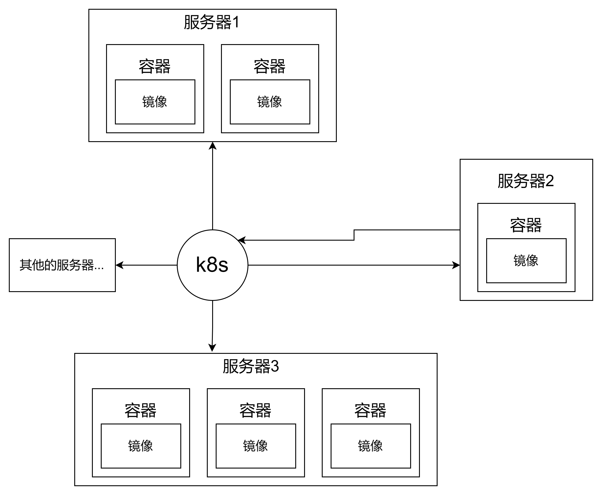
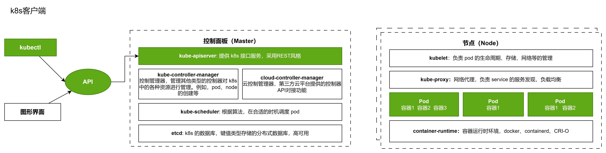
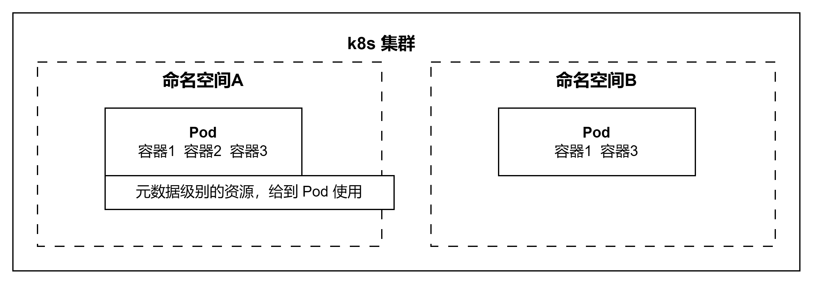
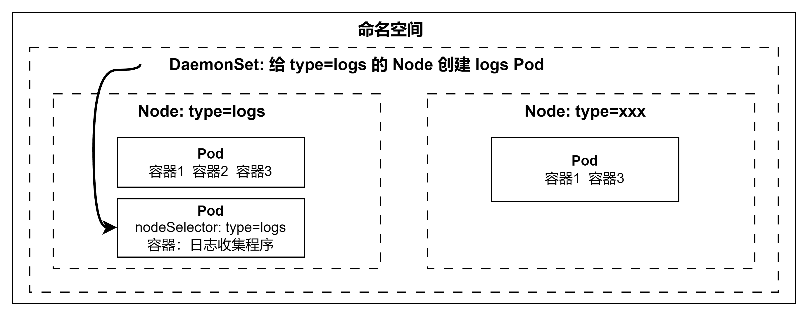
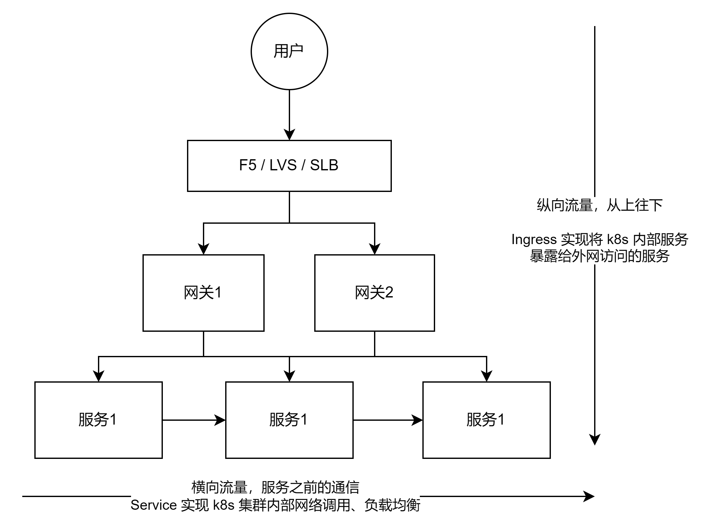
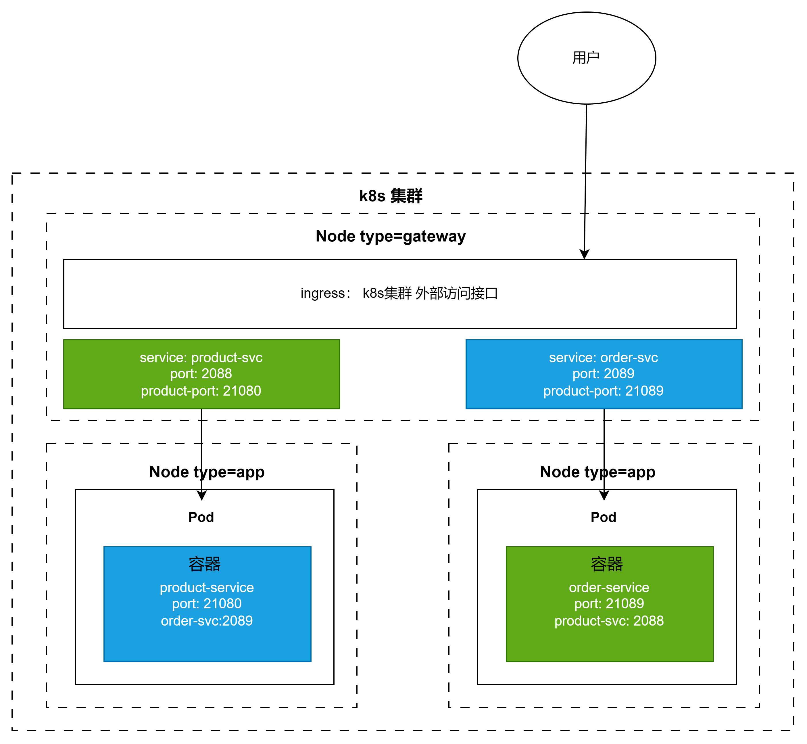
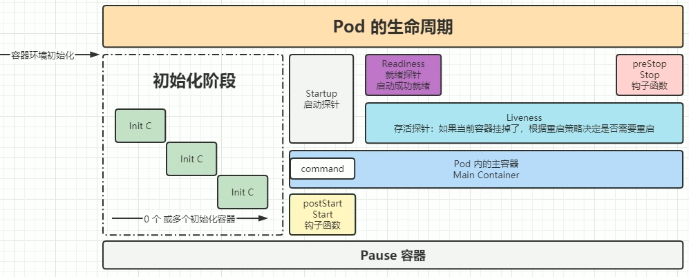
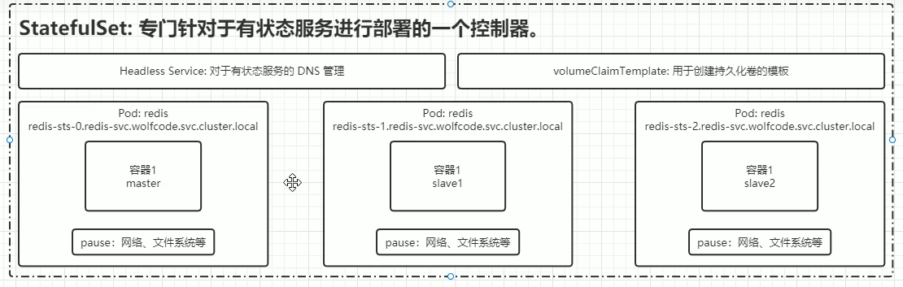
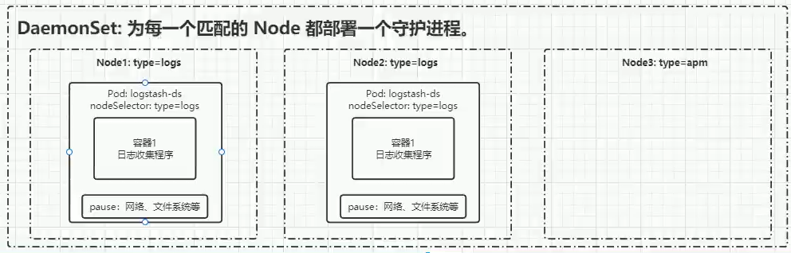
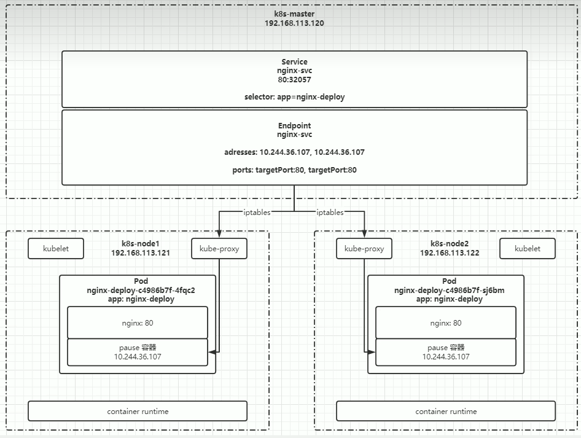

## 认识 k8s
Kubernetes 是 Google 一个开源的容器编排引擎，用来对容器化应用进行自动化部署、扩缩和管理

为什么需要 k8s 技术呢？
在 docker 等容器化部署技术愈发成熟，一台服务器上部署多个容器都是没问题的。那么这里就有一个问题，一台服务器上部署多个 docker 容器，还能用 docker compose 来管理。

在企业中，多台服务器上部署的多个容器呢？ 上压力了，就需要用到 K8s 来统一管理分布在不同服务器上的不同容器。

比如呈现下面的架构：




## k8s 的架构
采用 主-从 的形式，主节点用来管理外部的请求和从节点的调度



### Master
[kube-apiserver](https://kubernetes.io/zh-cn/docs/concepts/architecture/#kube-apiserver)
公开 Kubernetes HTTP API 的核心组件服务器。

[etcd](https://kubernetes.io/zh-cn/docs/concepts/architecture/#etcd)
具备一致性和高可用性的键值存储，用于所有 API 服务器的数据存储。

[kube-scheduler](https://kubernetes.io/zh-cn/docs/concepts/architecture/#kube-scheduler)
查找尚未绑定到节点的 Pod，并将每个 Pod 分配给合适的节点。

[kube-controller-manager](https://kubernetes.io/zh-cn/docs/concepts/architecture/#kube-controller-manager)
运行[控制器](https://kubernetes.io/zh-cn/docs/concepts/architecture/controller/)来实现 Kubernetes API 行为。

[cloud-controller-manager](https://kubernetes.io/zh-cn/docs/concepts/architecture/#cloud-controller-manager) (optional)
与底层云驱动集成
### Node
[kubelet](https://kubernetes.io/zh-cn/docs/concepts/architecture/#kubelet)
确保 Pod 及其容器正常运行。

[kube-proxy](https://kubernetes.io/zh-cn/docs/concepts/architecture/#kube-proxy)（可选）
维护节点上的网络规则以实现 Service 的功能。

[容器运行时（Container runtime）](https://kubernetes.io/zh-cn/docs/concepts/architecture/#container-runtime)
负责运行容器的软件，阅读[容器运行时](https://kubernetes.io/zh-cn/docs/setup/production-environment/container-runtimes/)以了解更多信息。

注意：
+ api-server 是执行操作的核心，k8s 的所有操作都会先请求 api-server，然后等响应
+ 通过 kubectl --> 请求接口，发送请求 --> apiserver --> 最终作用于 Pod
+ Node 是一台服务器 -> 下面可运行多个 Pod -> Pod 可运行多个容器

### 其他组件
+ kube-dns： dns解析
+ ingress Controller： 外网访问
+ Prometheus： 资源监控
+ Dashboard： 图形化界面
+ Federation： 集群间的调度
+ Fluentd-elasticsearch： 日志采集

## 核心概念
### 服务分类
分成两种类别： 
+ 有状态
+ 无状态

区分他们两个，可以从函数式编程的视角来看
**有状态**： 不是纯函数，会对环境产生依赖。例如，redis 服务需要存储东西到服务器上，作持久化数据。如果进行扩容，需要将上一台服务器上的数据，都重新复核一遍到扩容服务器。如果没有复刻，那么该服务可能不能正常提供服务。

**无状态**： 是纯函数，不会因为外部的改动而改动。无论是扩容、缩容都对这个服务没有影响，提供稳定的服务。 例如，nginx等服务。

### 资源和对象
在 k8s 的世界中，一切都是被抽象为 “资源”，例如，Pod、Node等，会有一个东西来描述 这些资源，也就是“资源清单”。

“资源清单”：其实就是用 json /yaml 格式来描述资源 --> 定义“类”的模样

其实，本质上，资源是一个抽象的概念，可以类似于 “类”。 对象就是这个 “类” 创建出来的实例。

#### 对象的规约和状态
**规约**： 在配置 资源清单 时，会描述某个对象的 **理想** 情况。这个理想情况，就是规约
**状态**： 由 k8s 维护的状态，是 对象真实的正真的运行时状态。k8s 会尽可能的将目前状态向 规约状态靠近。

#### 资源的分类
+ 集群级： k8s 集群
+ 命名空间级： 在集群内部，在细分为多个命名空间
+ 元数据级： 主要作用于 Pod



具体来说：

##### 元数据级
+ HPA：Horizontal Pod Autoscaler  --> Pod 自动扩容，可根据 CPU 使用率或自定义指标自动对 Pod 进行扩容 / 缩容，控制管理器每隔 30s 查询 metrics 的资源使用情况
+ PodTemplate： Pod 的描述 --> 类似于 Pod 的模板
+ LimitRange： 对集群内的 Request 和 Limits  的配置做一个全局的统一的限制 --> 批量设置了某一个命名空间的 Pod 资源使用限制

##### 集群级
+ Namespace： 命名空间
+ Node： 节点
+ ClusterRole： 定义集群级别的一组角色权限
+ ClusterRoleBinding： 将角色绑定在某个集群上

##### 命名空间
*Pod*： 是可以在 Kubernetes 中创建和管理的、最小的可部署的计算单元（所有的命令，都会被封装成Pod 去执行）。是一组（一个或多个） 容器
	Pod 中的内容总是一同调度，在共享的上下文中运行，文件系统、网络等都是共享的。 Pod 所建模的是特定于应用的“逻辑主机”，其中包含一个或多个应用容器， 这些容器相对紧密地耦合在一起。 
	--> 最好是 “one-container-per-Pod” 一个 Pod 一个容器的模式

*副本集*（replicas）： 根据 PodTemplate 来创建几个Pod

*控制器*： 可以理解为更为抽象的 Pod ，管理者 Pod 的创建
	- 适用于*无状态服务*
		- ~~RC: ReplicationController(已废除)~~
		- RS: ReplicaSet --> 可用 Selector 指定用哪个 **Pod** 的模板进行 自动扩容和缩容
		- *Deployment* --> 可以认为这是对 RS 更上一层的封装
			- 创建 ReplicaSet / Pod（自动创建 RS）
			- 滚动升级 / 回滚  --> 类似于静默升级吧，用户是无感知的
			- 平滑扩容 / 缩容
			- 暂停与恢复 deployment
	- 适用于*有状态服务*（持久化数据、顺序访问）
		- *StatefulSet* --> 每个 Pod 的DNS格式为 `statefulSetName-(0...N-1).serviceName.namespace.svc.cluster.local`
			- Headless Service: 来做 dns 服务【用 Pod 的服务名 当作 域名】、顺序访问【数据库架构相关，例如，mysql 主从架构，需要有一个主节点、其他从节点，这就需要有顺序 -> 顺序通过 数字 来保证】
			- volumeClaimTemplate： 在 k8s 集群中申请一块空间，用来做持久化存储
	- 守护进程
		- DaemonSet： 类似于横向抽离，在符合标签的节点中，创建 Pod。
	- 任务 / 定时任务
		- Job
		- CronJob



*服务发现*:
	- Service： 横向流量(东西流量)
	- Ingress： 纵向流量(南北流量)



节点之间：Service 服务，进行通信
外部： Ingress 服务，提供接口通信


注意： 同一个 Node 之下的 Pod 是可以互相通信的，Pod 之下的容器之间，所有的资源（网络、文件系统都是共享的）

不同 Node 之前，通信需要端口映射 --> Service 服务，可以将 Pod 容器中的服务映射到另一个端口，其他 Node 中的服务可以通过这个外部映射端口，访问到Node，从而访问到 Pod 中的服务。

就像上面的图示：
order 服务要访问到 product 服务，需要访问 product 的service服务中暴露的端口和服务名
	-> product-svc:2088

# k8s 基本操作
## 操作资源

### 资源类型与别名
+ pods --> po 
+ deployment --> deploy
+ services  --> svc
+ namespace --> ns
+ nodes --> no
+ replicaset -> rs
+ pvc -> pvc
+ statefulSet -> sts
+ hpa -> hpa
+ endpoints -> ep

### 格式化输出
可指定以什么格式对某个资源进行输出
+ 输出 json 格式 --> -o json
+ 仅打印资源名称 --> -o name
+ 以纯文本的格式输出所有信息 --> -o wide
+ 输出 yaml 格式 --> -o yaml
例如，
我需要知道 deployment  资源的详细信息
`kubectl get deploy -o wide`
也可以获取某个资源下的信息，以 yaml 格式输出
`kubectl get deploy nginx -o yaml`


### 获取资源信息
`kubectl get xxx --> xxx 指的有 pod、deployment、namespace等` 详细信息看上一节资源和对象
要记住，k8s的世界中，一切都是资源

**指定命名空间查询资源**
`kubectl get xxx -n xxx`

**查看某个资源的运行详细信息**
`kubctl describe 哪类资源 资源中的名字`
例如，
查看 pod 中的 nginx-demo（pod 的名称） 的信息
`kubectl describe po nginx-demo`

**查看/编辑 某个资源的配置文件信息**
`kubectl edit 资源 -n 命名空间 名称`

**持续监听资源状态**
`kubectl get 资源 -w`

### 删除资源
`kubectl delete 哪类资源 资源中的具体名称`
例如，
删除由 deployment 创建出来的 nginx 信息
`kubectl delete deploy nginx` 
+ 这里 deploy 是 deployment 的缩写
+ nginx 是 deployment 中的名字

### 创建资源
`kubectl create -f xxx.yaml` -> 通过 yaml 配置文件的形式进行资源的创建

`kubectl create 资源 资源名称 --image=容器` -> 使用控制器创建 Pod

### 标签相关
**创建标签** ： 在创建对应资源时， 在yaml文件中创建； 临时给资源加标签
`kubectl label 资源 资源名称 标签(key-value)`
例如：
`kubectl label po nginx-po app=java`

**更新标签**
`kubectl label po nginx-po app=hello --overwrite`

**查找标签资源**
-l : 筛选条件
-A : 查找所有命名空间
	*查找单节点 - 用 selector 的方式* :
		 精确查找： `kubectl get po -A -l app=hello`
		 多条件： `kubectl get po -l 'version in (1.0.0, 1.0.2, 1.1)'`
		 不等式： `kubectl get po -l version!=1.0.0, app=java`
	 *查找所有节点的 labels* : `kubectl get po --show-labels`
	
# 基本 Pod 的yaml配置文件
```yaml
appVersion: v1 # api 文档版本
kind: Pod # 资源对象类型，也可以配置为 Deployment、StatefulSet等
metadata: # Pod 相关的元数据
	name: nginx-p0 # Pod 的名称
	labels: # Pod 的标签【下面的是自定义描述】
		type: app
		version: 1.0
	namespace: 'default' # 命名空间配置【默认是defalut】
spec: # 配置 Pod 的规约状态
	container: # 对于 Pod 中容器的描述
	terminationGracePeriodSeconds: 30 # 默认 30s，给30秒来给用户处理 Pod 销毁数据等
	- name: nginx # 容器的名称
	  image: nginx:1.7.9 # docker能够真正pull到的镜像
	  imagePullPolicy: IfNotPreset # 镜像拉取策略
	  startupProbe: # 启动探针配置 三种探测类型 -> 三种探测方式【全排列】
		httpGet:
			path: /index.html
		# tcpSocket:
		#	port: 80 
		timeoutSeconds: 2 # 超时时间
		successThreshold: 1 # 一次探测成功，即为成功
		periodSeconds: 3 # 允许重复 3次请求
	  lifecycle: # 生命周期配置
		  preStop:
			  exec:
				  command: 
				  - sh
				  - -c
				  - "echo bye >> index.html"
	  command: # 指定容器启动时的执行命令
	  - nginx
	  - -g
	  - 'daemon off;'
	  workingDir: /usr/share/nginx.html # 容器启动的工作目录
	  ports：
	  - name: http # 端口名称
	    containerPort: 80 # 容器内部暴露的端口
	    protocol: TCP # 描述端口是基于哪种协议通信
	  env: # 设置环境变量
	  - name: TEST # 环境变量的名称
	    value: 'xxx' # 对应的值
	  resources:
		requests: # 最少需要多少资源
			cpu: 100m # cpu 最多有 1000m，意思是最少使用 0.1 个核心
			memory: 128Mi # 内存至少有 128兆
		limits: # 最多需要多少资源
			cpu: 200m 
			memory: 256Mi
	restartPolicy: OnFailure # 重启策略
```

# 探针
检测 Pod 状态的一种方式：

## 探针类型
+ StartupProbe -> （排他性，优先级最高）检测容器是否真正的启动起来了
+ LivenessProbe -> 与 Pod 的重启策略配合，若容器挂了，自动识别重启策略，重启 Pod
+ ReadinessProbe -> 探测容器内的程序是否健康，若返回值为success，那么就认为该容器已完全启动，并且该容器说可以接收外部流量的

## 探测方式
> 可在任意探针中配置
+ ExecAction -> 用命令行的方式进行探测
+ TCPSocketAction -> 通过 tcp 连接检测容器内的端口是否开放
+ HTTPGetAction -> 通过 http 请求的方式，看返回状态码是否在 200-400 之间

## 参数配置
+ initialDeaySecond： 60 -> 假设容器的初始化时间
+ timeoutSeconds： 2 -> 超时时间(重发请求)
+ periodSeconds： 5 -> 监测间隔时间
+ successThreshold： 1 -> 检查 1 次成功表示成功
+ failureThreshold： 2 -> 监测失败 2 次就表示失败

# Pod 生命周期


生命周期的一些配置项：
```yaml
lifecycle:
	postStart:
		exec:
			command:
			- sh
			- -c
			- "echo hello > /index.html"
	preStop:
		exec:
			command:
			- sh
			- -c 
			- "echo sleep 50; echo bye >> /index.html"
```

preStop 常常与 terminationGracePeriodSeconds(删除宽限时间) 配置一起设置

# Deployment
创建 deployment 控制器
`kubectl create deploy nginx-deploy --image=nginx:1.7.9`

## 常见配置
```yaml
apiVersion: apps/v1 # deployment api 版本
kind: Deployment # 资源类型 
metadate: # 元数据
	labels: # 标签
		app: nginx-deploy
	name: nginx-deploy # deployment 名字
	namespace: default
spec:
	replicas: 1 # 副本集
	revisionHistoryLimit: 10 # 进行回滚更新后，保留的历史版本数
	selector: # 选择器，用来找到匹配的 RS
		matchLables: # 根据 label 匹配
			app: nginx-deploy # 匹配的标签 
		strategy: # 更新策略
			rollingUpdate: # 滚动更新 
				maxSurge: 25% # 进行滚动更新时，更新的个数最多可以超过期望副本数的个数/比例
 				maxUnavailable: 25% # 更新时，最多可以有多少个不更新成功
			type: RollingUpdate # 更新类型，滚动更新
		template: # Pod 模板
			metadata:
				labels:
					app: nginx-deploy
			spec:
				container: 
				- image: nginx:1.7.9
				  imagePullPolicy: IfNotPreset
				  name: nginx
				restartPolicy: Always
				terminationGracePeriodSeconds: 30
```

## 更新/回滚
在 核心概念 篇中， 讲到 deployment 比 RS 的功能更强一点， 回顾一下
+ 扩容 / 缩容 -> 因为 deploy 中管理了 rs
+ 滚动更新 / 回滚
+ 暂停 / 恢复
---
### 更新
*只有修改了 template 中的内容，才会触发 deploy 的自动滚动更新*

查看滚动更新过程 
`kubectl rollout statuts 资源 资源名称` 
或者
`kubectl describe deploy nginx-deploy` 

注意：
-更新或回滚操作，都是用 RS 来作为中间层，来进行操作的 
-什么意思呢?
-就是，不论更新还是回滚，deploy 都会创建 RS 来控制 Pod 的更新/回滚
	-具体来说，会先创建一个一模一样的 RS2，然后在新的 RS2 中一个一个替换旧 RS1 中的 Pod
	-更新/回滚，都会创建新的 RS，Pod也会关联最新的 RS

### 回滚
*如果更新有问题，比如镜像名有误等 错误操作， 那么就可以启动回滚*

**查看所有更新的版本**
`kubectl rollout history deployment/nginx-deploy`

**查看更新的详细信息**
`kubectl rollout history deployment/nginx-deploy --version=2` 

**回退上一个版本**
`kubectl rollout undo deployment/nginx-deploy`

**回退指定版本**
`kubectl rollout undo deployment/ngin-deploy --to-version=2`

注意：
如果 yaml 文件中，设置的 spec.revisionHistoryLimit 设置的为 0 ，那么 deployment 不允许回退

## 暂停/恢复
如果需要频繁的修改配置文件，可以先暂停，等更新完了之后，在恢复
这样只需要滚动更新一次

**暂停**
`kubectl rollout pause deployment <name>`

**恢复**
`kubectl rollout resume deploy <name>`

# StatefulSet
> 专门针对有状态服务进行部署的一个控制器



## 配置文件
```yaml
---
spec: 
	ports:
	- port: 80
	  name: web
	clusterIP: None
	selector:
		app: nginx 
---
apiVersion: apps/v1
kind: StatefulSet
metadata: 
	name: web
spec:
	serviceName: "nginx" # 使用哪个 service 来管理 dns
	reolicas: 2
	selector:
		matchLabels:
			app: nginx
	template:
		metadata:
			labels:
				app: nginx
		spec:
			containers:
			- name: nginx
			  image: nginx:1.7.9
			  imagePullPolicy: IfNotPresent
			  ports:
			  - containerPort: 80
			    name: web
			    protocol: TCP
		updateStrategy:
			rollingUpdate:
				partition: 0 # 控制第 >= 0个的pod进行更新 -> 实现灰度发布
			type: RollingUpdate # OnDelete -> 在删除时，才会进行更新
```

创建 sts 资源，与之前一直，指定yaml的方式来创建
`kubectl create -f web.yaml`

## 扩容/缩容
一条命令：
`kubectl scale statefulset web --replicas=5`

值得注意的是，扩容和缩容都是**有序**进行的

## 灰度发布
> 一句话来总结： 先给一小部分的服务器进行版本升级，配置一些路由规则，让少部分用户用到最新功能。如果测试下来，没有问题，那么全量更新。

利用滚动更新中的 partition 属性，可以实现简易版的灰度发布
例如：
我们有 5 个pod，如果当前的 partition 设置为3，那么此时滚动更新时，指挥更新那些序号 >= 3 的pod

注意：
但凡涉及到滚动更新的，只有更新了 pod template，k8s才会自动更新

# DaemonSet


一般运用在类似于，收集每一个节点的日志信息传到 es 
+ 收集日志
+ 清理数据
+ 等
如果不适用 DaemonSet ，那么需要开发者为每一个 Node 手动部日志收集的应用，一方面是不方便，另一方面是扩展性不高。如果扩容一台 Node ，那么开发者还需在部署。

那么使用 DaemonSet 就没有这个问题，我们只需要创建 DaemonSet 的模板，k8s会直接监听到 Daemon Set 选中的 Node。自动在 Node 上部署。扩展性的问题，也迎刃而解了，k8s也自动监听自动部署。

指定 pod 只运行在指定的 Node 节点上：
+ nodeSelector: 只调度匹配到指定 label 的 Node 上
+ nodeAffinity: 功能更丰富的 Node 选择器，支持集合操作
+ podAffinity: 调度到满足条件的 Pod 所在的 Node 上

# HPA
可以自动实现对 deploy 和 sts 进行扩容和缩容
`kubectl autoscale deploy <deploy_name> --cpu-percent=20 --min=2 --max=5` -> cpu 最大为 20%，在此期间，k8s会扩容到最少 2台，最多 5台deployment
 
可以在 deploy 或sts 的yaml配置文件中，进行资源的配置
```yaml
resources:
	limits:
		cpu: 10m
		memory: 128Mi
	requests:
		cpu: 200m
		memory: 256Mi
```
只要超过配置的资源范围，那么k8s就会自动对 deploy 或 sts 进行扩容和缩容

可以通过`kubectl get hpa`获取HPA信息
也可以通过`kubectl top po`获取pod资源的分布情况(cpu、内存)


# Service

- Service 主要用于：
    - 提供稳定的 DNS 名称和虚拟 IP（ClusterIP）
    - 负载均衡到多个后端 Pod（无论是否跨节点）
    - 抽象 Pod 生命周期（Pod 会重建，IP 会变，但 Service 不变） 

提供稳定的访问，即使 Pod 滚动更新或被删除，对于 *客户端* 而言，访问的地址都没有发生变化。访问的都是同一个地址（service 提供的地址）

**跨节点 Pod 通信的基础是 CNI 提供的“扁平网络”（flat network）**
 + Pod 之间怎么通信？ --> 可以直接用 ip 【不是虚拟的，是真实存在的，只不过生命周期比较短】 来通信，生产中更多是使用 `pod-name.service-name.namespace.svc.cluster.local` 这种 `Service 或 Headless Service + DNS` 模式来通信。

+ 容器之间怎么通信？ --> Pod 内的网络系统、文件系统都是共享的（类似于 Pod 是容器的宿主机）

*service 简易工作原理： *


**Service 配置文件**
```yaml
apiVersion: v1
kind: Service
metadata:
	name: nginx-svc # Service 名字
	labels:
		app: nginx # Service 标签
spec:
	selector: # k8s 会根据选择器来判断那些 pod 需要 Service 服务 
		app: nginx-deploy # pod 中有这个 app: nginx-deploy 选择器的 pod 会被 Service 代理
	ports: # 端口映射
	- port: 80 # Service 自己的端口，在使用内网 ip 访问时使用 
	  targetPort: 80 # 目标 pod 的端口 -> 外部的流量会先到 service服务的80端口转发到 pod服务的80
	  name: web # 端口的名字
	type: NodePort # 随机启动一个端口（30000-32767），映射到 ports 中的端口，该端口是直接绑定在Node上的，并且集群中的每一个node都会绑定这个端口
```

type 的其他常见类型：
+ ClusterIP： type 的默认配置，只能在集群内部使用
+ ExternalName： 用域名的方式访问
+ NodePort： 
+ LoadBalancer

创建 pod 通过 service name 进行访问：
`kubectl exec -it <pod name> --sh` -> 进入容器内部，使用命令
`curl http://<service name>.<namespace>` -> 还可以访问不同命名空间下的服务


 

